# tinymfv figures

A gallery of the culture maps and range plots. Each is captioned the newspaper way: a title, a
one-line subtitle saying what you are looking at, a short caption pointing out what to notice, and a
small-print footnote with the method and sources.

Two readouts appear here. The frontier-model panel is read by *rated sampling*: the model rates every
option 1-5 as JSON, twelve times, with the option order shuffled each time to cancel positional bias,
because those API models expose no token probabilities. The steering showcase is read by *logprobs*:
the exact log-probability of the answer token, eight samples per item, on a local model we control.

Regenerate everything with the two commands at the bottom.

---

## The models are all godless hippies

*17 frontier LLMs placed among ~90 human societies on the World Values Survey map*

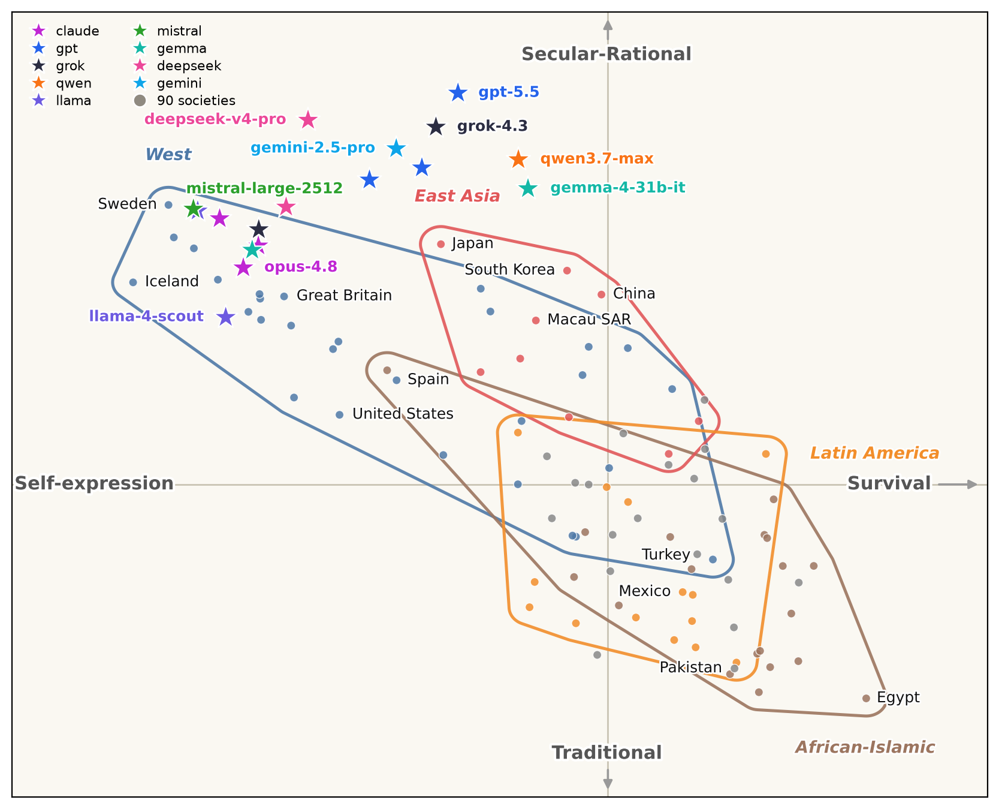

Grey dots are human societies, coloured stars are language models tinted by lab family (warm for
Chinese labs, cool for Western). Left to right runs from survival values to self-expression; bottom to
top from traditional to secular-rational. Every model lands in the top-left, more secular and more
self-expressive than almost any country on earth. The open-weight models (llama, mistral, gemma) sit
nearest the human West, while the big reasoning models (gpt-5.5, gemini, grok) drift furthest out. The
axis is flipped from the textbook chart so the West sits in the west.

<sub>Each position is the mean signed 0-1 endorsement over that axis's World-Values items. Human
values are approximated from GlobalOpinionQA (the WVS/EVS subset), so this is an *approximate*
Inglehart-Welzel map, three themes per axis rather than the full battery. Per-model 95% intervals are
in [`wvs/wvs_model_ci.md`](wvs/wvs_model_ci.md). Read by rated sampling, N=12, order shuffled. Sources:
Inglehart & Welzel, *Modernization, Cultural Change, and Democracy* (2005); World Values Survey;
GlobalOpinionQA (Durmus et al. 2023).</sub>

---

## Steering one model across the value maps

The maps below all show the **same run**. The base model **Qwen3-4B** is read at c=0 (black), then
pushed along a single **Authority** vector to +c (red, more Authority) and -c (blue, less). The vector
is a PCA direction that [steering-lite](https://github.com/wassname/steering-lite) builds from an
`authority-respecting` versus `authority-disregarding` persona pair; tinymfv only measures where the
model lands, by logprobs, eight samples per item. Each instrument gets two maps: a **quadrant map** on
named axes taken from the literature, and an **ipsative PCA map** whose axes are the blind top-two
principal components, with a compass rose showing how the factors load.

### Moral Foundations Questionnaire-2

**Steering toward the binding corner**

*Qwen3-4B on the moral-foundations map, walked up an Authority vector*

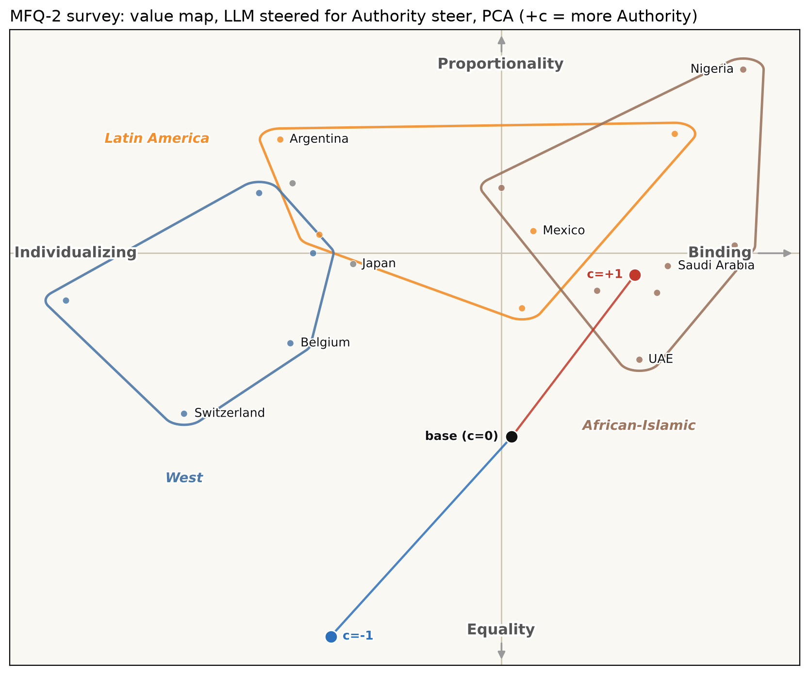

The black dot is the base model. Steer it up on Authority and it walks out of the liberal West (care,
equality) across to the binding corner shared by the African-Islamic and East-Asian worlds (loyalty,
authority, purity). Left to right is individualizing versus binding morality; bottom to top is the
fairness split, egalitarian versus meritocratic.

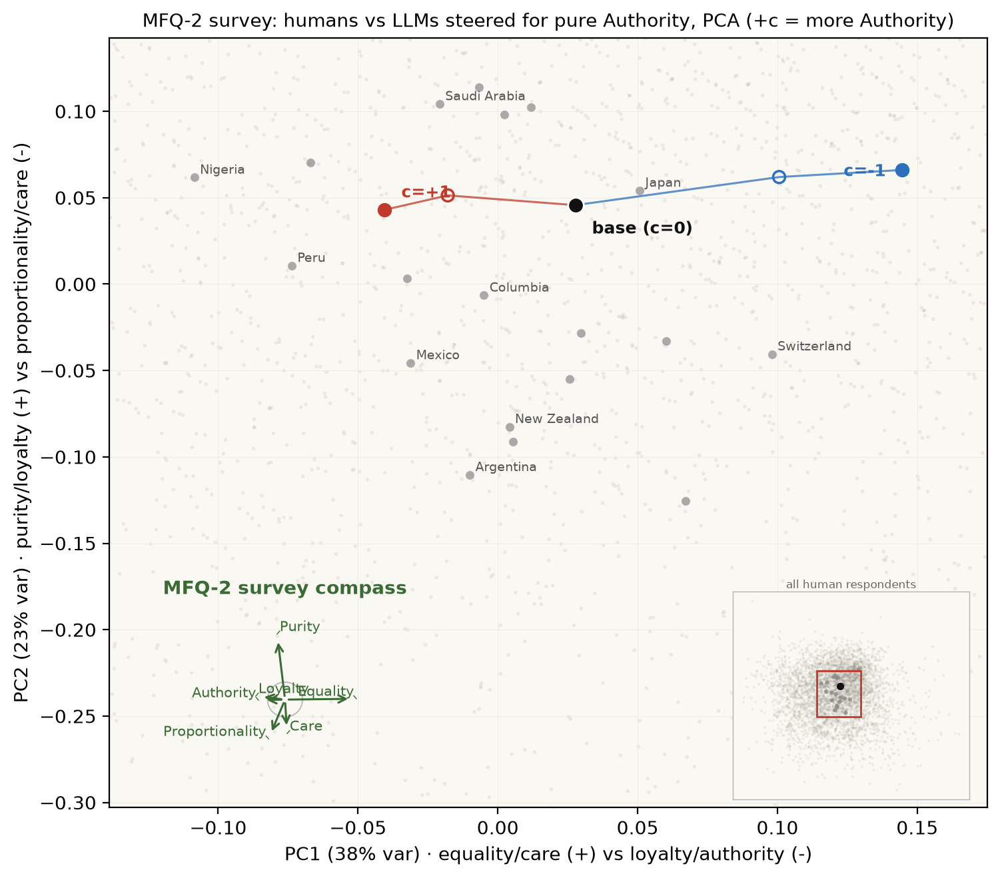

The same run on blind PCA axes: no named poles, but the steer path and the zone hulls tell the same
story.

<sub>Sources: MFQ-2 (Atari et al., *Morality beyond the WEIRD*, 2023); the individualizing/binding
split (Graham, Haidt & Nosek 2009). Read by logprobs, N=8.</sub>

### Moral-foundation vignettes (MFV)

**Which foundation the model reaches for**

*The namesake instrument: a moral foundation read straight from short vignettes*

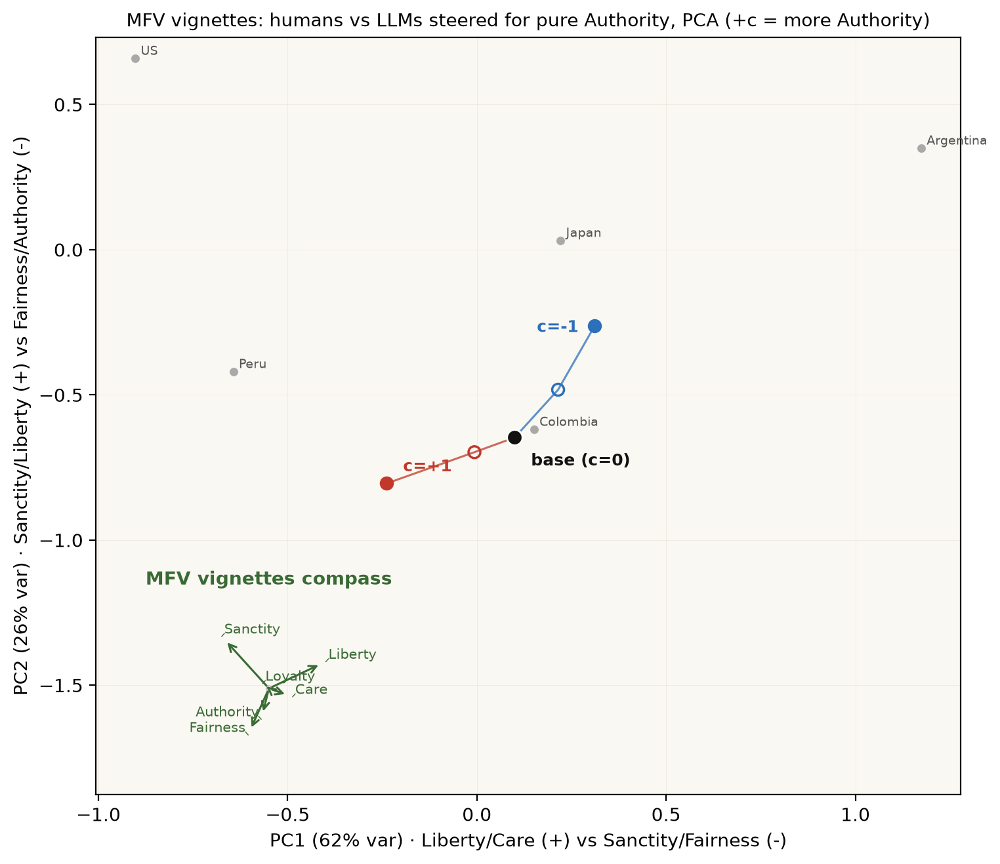

MFV scores a foundation from a moral vignette rather than a survey item, so its map is the blind
ipsative (relative-emphasis) PCA only. PC1 separates liberty and care from sanctity and fairness; the
Authority steer pushes the model down and to the right, toward the binding foundations. A named-axis
quadrant map is still pending here, because the readout lives in z-scored emphasis space, not the 0-1
endorsement the other quadrant maps assume.

<sub>Sources: MFV (Clifford et al. 2015; human norms per the bundled CSV provenance). Read by logprobs,
N=8.</sub>

### Big Five

**The two meta-traits**

*Big Five personality, collapsed onto Plasticity and Stability*

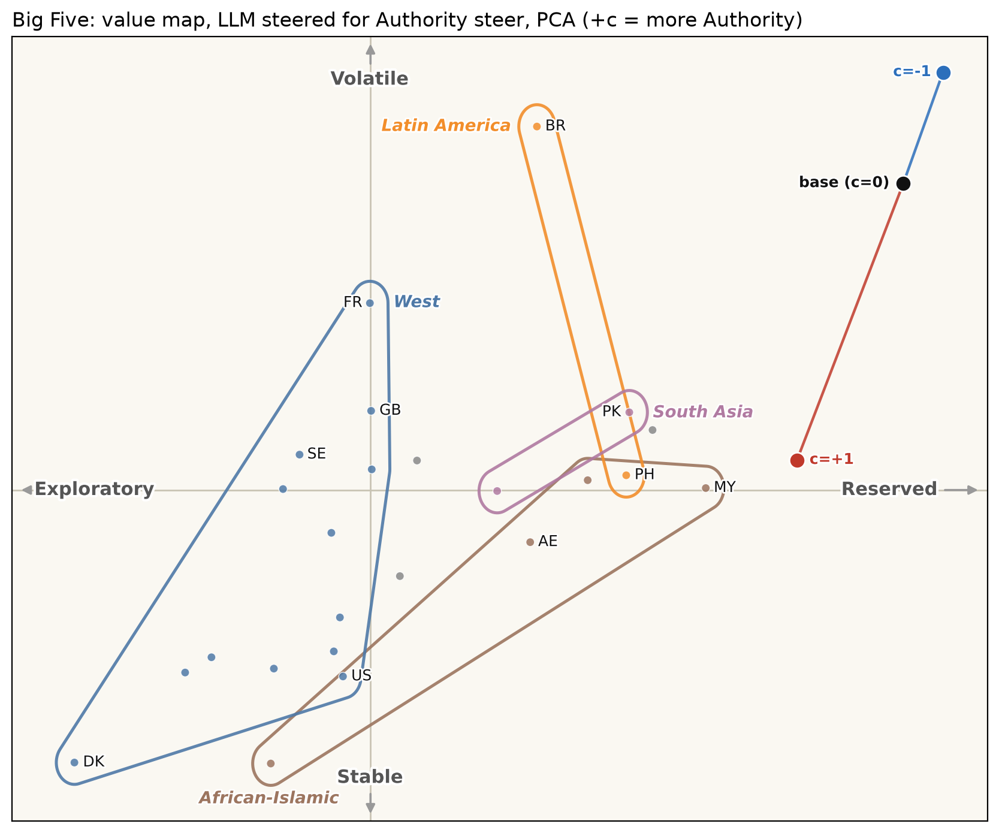

Left to right runs from reserved to exploratory (Plasticity, the openness-plus-extraversion factor);
bottom to top from volatile to stable (Stability, agreeableness plus conscientiousness plus emotional
steadiness). Both ends of each axis are named so a point reads as a contrast rather than a lone trait.

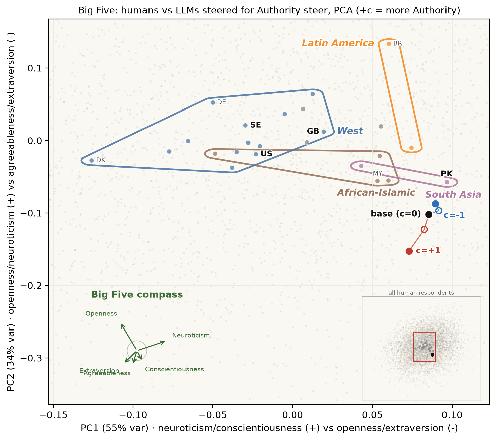

The same run on blind PCA axes.

<sub>Sources: the Big Five meta-traits (DeYoung, Quilty & Peterson 2007). Read by logprobs, N=8.</sub>

### Humour styles

**Humour doesn't map the world**

*Humour styles, and an honest negative result*

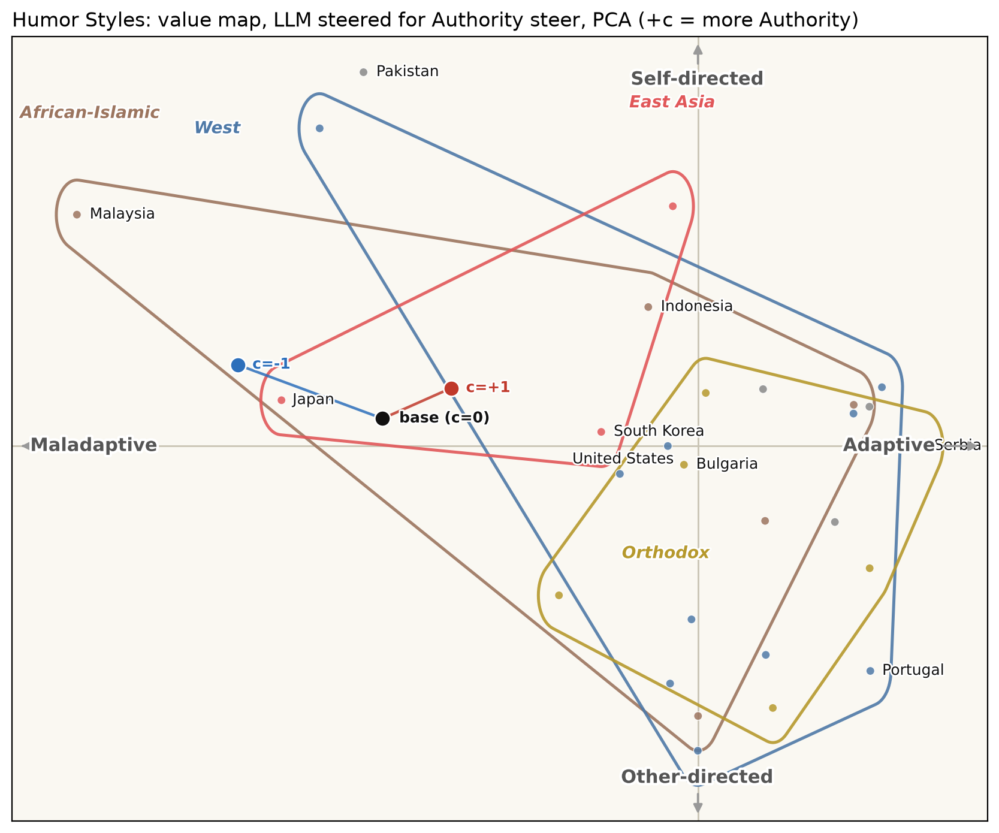

Left to right runs from maladaptive humour (aggressive, self-defeating) to adaptive (affiliative,
self-enhancing); bottom to top from other-directed to self-directed. The regional hulls overlap almost
completely: humour style simply does not sort societies the way values do, so the zones are drawn but
carry little signal. That flat result is real, not a plotting artefact.

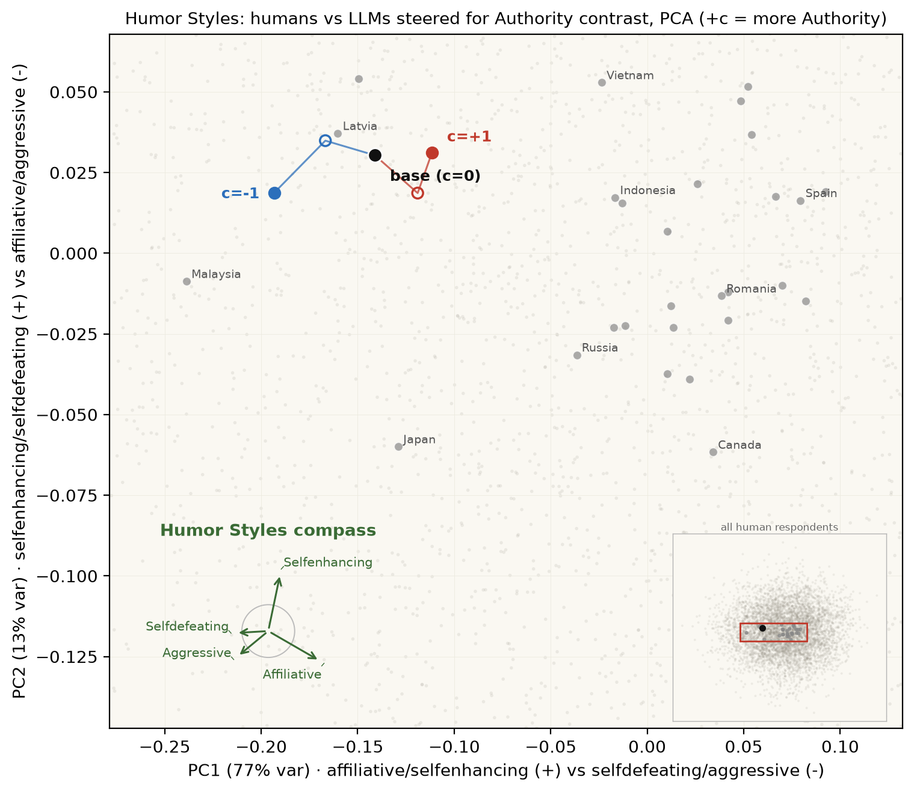

The same run on blind PCA axes; the zones stay tangled here too.

<sub>Sources: the Humour Styles Questionnaire (Martin et al. 2003). Read by logprobs, N=8.</sub>

---

## The steer, factor by factor

*One instrument per plot: the human societies as a grey strip, their median a black rule, and the
Authority steer as a sweep from -c (blue) to +c (red), so a small model move stays legible against
the human spread.*

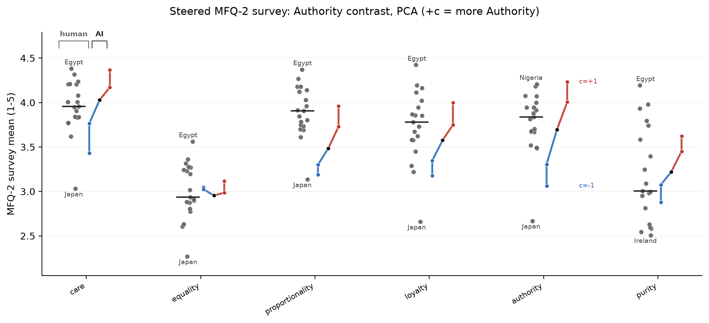

Moral Foundations Questionnaire-2. The fairness and binding factors move most under the steer.

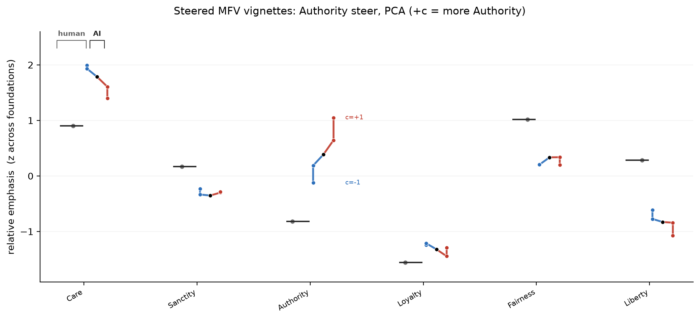

Moral-foundation vignettes. Authority and sanctity climb as the model is steered up.

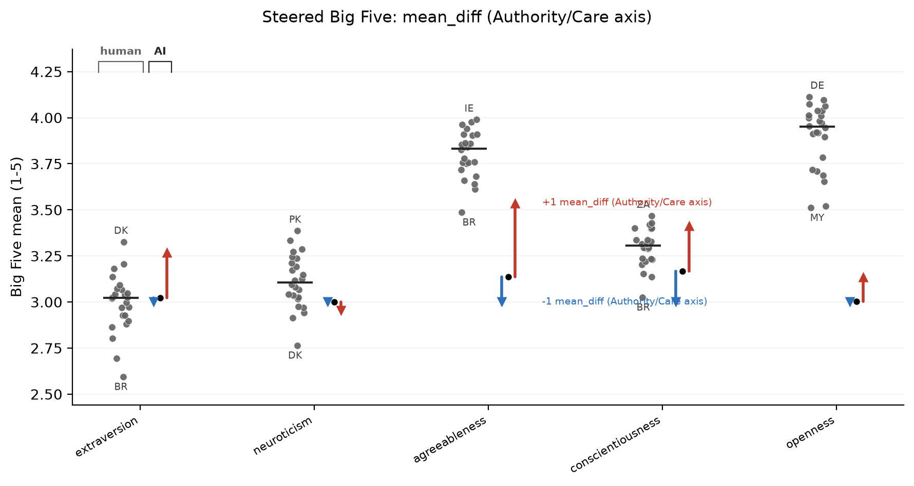

Big Five. The personality factors barely budge; this is a values push, not a personality one.

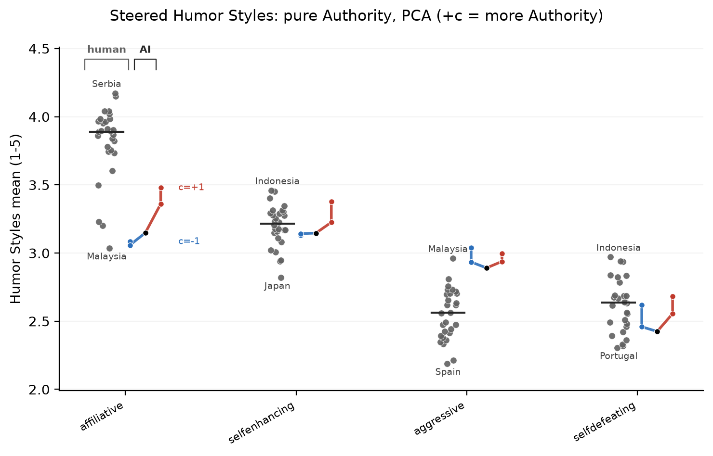

Humour styles. Flat, matching the tangled map above.

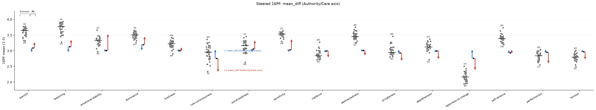

Cattell's 16PF, the widest instrument at sixteen factors, shown for completeness.

---

## Regenerate

```bash
# Frontier-model WVS panel (rated sampling; needs the cached reads)
uv run python scripts/wvs_map.py --local-model "" --api-models \
  --cache /tmp/claude-1000/wvs_iw_rated.json --out docs/img/wvs/wvs_map_iw.png

# Steering showcase (all instruments) from a steering-lite run
uv run python scripts/plot_steer_showcase.py \
  --run-dir ../steering-lite/outputs/20260630T222000Z_pure_authority_mundane15_pca_readme_mfv_mfq2_humor_big5_n8 \
  --out docs/img/showcase --vec-label "Authority steer, PCA (+c = more Authority)" \
  --coherence-frac 0.99 --contrast-frac 0.000001 --margin-frac 0.50
```
