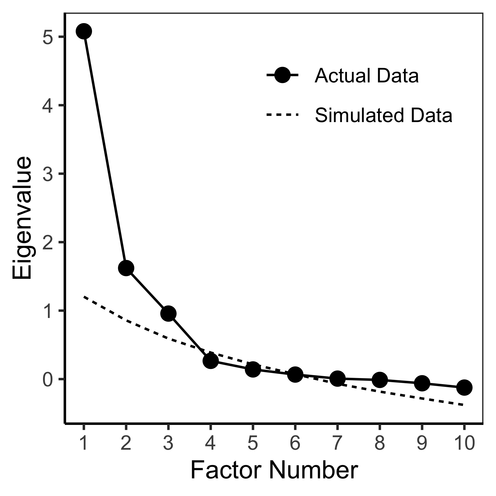
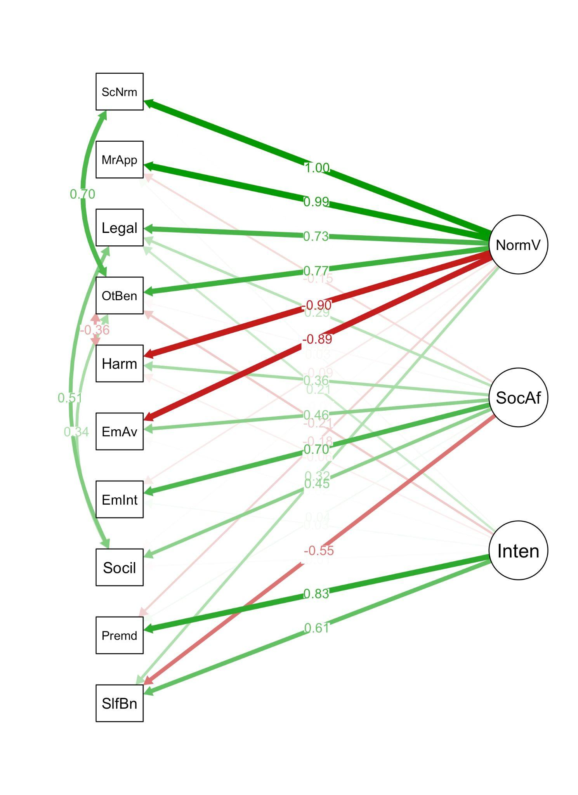
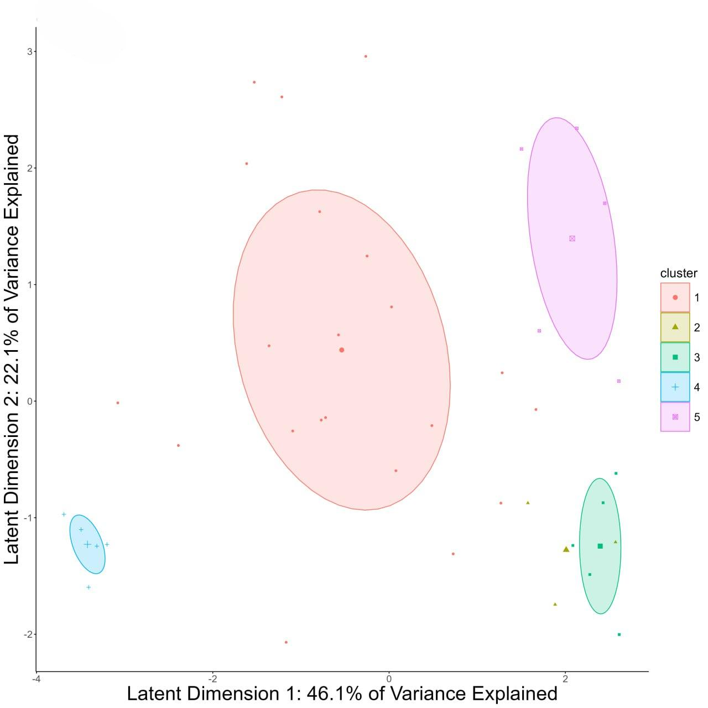
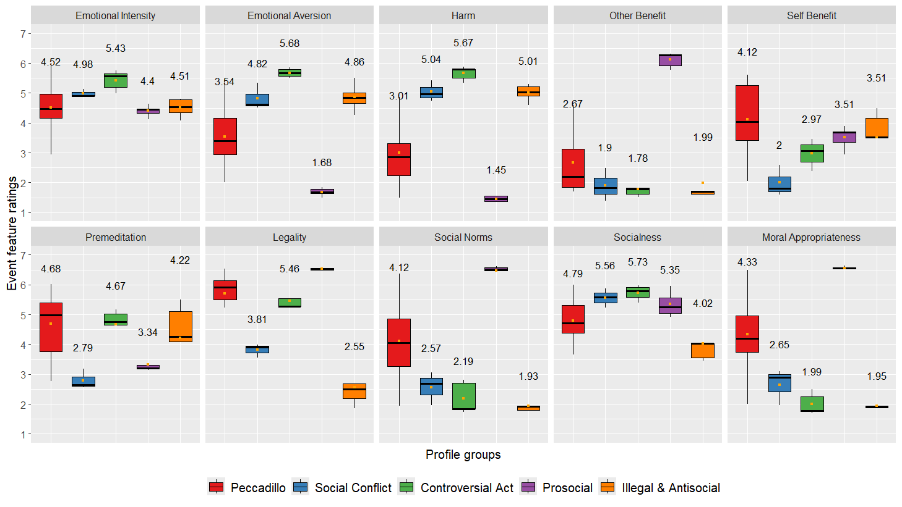

# Validation of the Russian Version of the Realistic Moral Vignettes for Studies of Moral Judgments 

Zorina Rakhmankulova1, Rustam
Asgarov1,2, Eliana Monahhova3, Semyon
Mening3,4, Isak B. Blank1, Vasily
Klucharev1

1 International Laboratory of Social
Neurobiology, Institute for Cognitive Neuroscience, National Research
University Higher School of Economics, Moscow, Russia

2 Food and Biotechnology Department,
Faculty of Engineering, Baku Engineering University, Baku,
Azerbaijan

3 Centre for Cognition and Decision
Making, Institute for Cognitive Neuroscience, National Research
University Higher School of Economics, Moscow, Russia

4 Laboratory for Cognitive Research,
Faculty of Social Sciences, National Research University Higher School
of Economics, Moscow, Russia

Zorina Rakhmankulova
[<u>https://orcid.org/0000-0001-9294-2983</u>](https://orcid.org/0000-0001-9294-2983)

Rustam Asgarov
[<u>https://orcid.org/0000-0001-6739-6394</u>](https://orcid.org/0000-0001-6739-6394)

Eliana Monahhova
[<u>https://orcid.org/0000-0001-9426-3642</u>](https://orcid.org/0000-0001-9426-3642)

Semyon Mening
[<u>https://orcid.org/0009-0007-1740-4932</u>](https://orcid.org/0009-0007-1740-4932)

Vasily Klucharev
[<u>https://orcid.org/0000-0002-5257-3789</u>](https://orcid.org/0000-0002-5257-3789)

Correspondence concerning this article should be addressed to Eliana
Monahhova or Rustam Asgarov, Center for Cognition and
Decision Making, Institute for Cognitive Neuroscience, National Research
University Higher School of Economics, Krivokolenny Pereulok 3, 101000
Moscow, Russia. Email:
[<u>e.monakhova@hse.ru</u>;](mailto:e.monakhova@hse.ru)
[<u>rustamasgarov@gmail.com</u>](mailto:rustamasgarov@gmail.com)

# Abstract

Moral judgments and behavior are shaped by individual
experiences and cultural environments. In two online studies, we used a
standard set of moral vignettes to examine the generalizability of the
original factor structure of moral judgments by testing two independent
samples of the Russian population (Study 1, N = 247; Study 2, N =
223). In Study 1, the exploratory factor analysis revealed three
components that accounted for most of the variance: norm violation,
social affect, and intention. In Study 2, the factor structure of the
identified moral components was validated by confirmatory factor
analysis. Latent profile analysis revealed five distinct profiles of
moral scenarios: Peccadillo, Illegal-Antisocial, Controversial Act,
Prosocial, and a novel profile specific to the Russian sample—Social
Conflict—as compared to the previous study of the American population.
These findings suggest fundamental similarities in moral judgment
processes across cultures while also highlighting culture-specific
patterns in moral scenario categorization. This study
also provides researchers with a battery of vignettes that can be used
in cross-cultural studies of moral judgment.

*Keywords:* vignette, event feature, moral judgment, moral component,
latent profile

# 

# Validation of the Russian Version of the Realistic Moral Vignettes for Studies of Moral Judgments

Human moral judgments and behavior have been extensively studied in
philosophy, sociology, psychology, and neuroscience. Moral judgments
enable people to evaluate others’ actions, attitudes, and even
personalities according to certain social, cultural, and universal
norms. Some scientific and philosophical frameworks suggest that moral
judgments and behavior are predominantly influenced and guided by an
innately operating moral sense of intuitions and emotions, while moral
reasoning is regarded only as a post hoc cognitive process for
justifying prior moral judgments when inquired (Haidt, 2001).
Importantly, an evolutionary perspective suggests that moral judgments
and morality support within-group altruism, cooperation, and normative
behavior (Greene & Haidt, 2002) and survival (Hawley, 2003).
Furthermore, the social intuitionist model proposes that the moral
judgments and moral behavior of an individual develop in a social and
cultural environment by the individual’s intuitions formed through
interpersonal processes and experience (Haidt, 2001). Therefore, social
and cultural experiences should consequently influence the individual’s
moral intuitions via reasoned persuasion and social persuasion effects
(Haidt, 2001). Thus, it is particularly important to develop
experimental tools to study moral judgments in different cultural
contexts.

Studies of moral judgments have used different types of stimuli, from
complex moral dilemmas (Greene et al., 2001), sentences containing
social norm violations (Heekeren et al., 2003), and moral claims (Moll
et al., 2001) to highly structured moral scenarios (e.g., Young et al.,
2007). Few seminal studies have introduced and validated a novel
experimental paradigm to assess the moral judgments of subjects with
American cultural background (Escobedo, 2009; Knutson et al., 2010;
Kruepke et al., 2018). Using three types of cue words for emotions,
actions, and superlatives, summaries of real-life events with positive
and negative moral experiences were collected from the participants’
episodic memories in the form of first-person short moral vignettes
(Escobedo, 2009). It allowed the creation of a set of standardized
stimuli in the form of vignettes (Knutson et al., 2010), which are based
on real-life experiences and improve the ecological validity of future
studies on moral judgments. Importantly, the findings from 30
individuals and 312 vignettes (Knutson et al., 2010) were later
replicated among 661 participants and 117 vignettes divided into three
subsets of 39 unique vignettes (Kruepke et al., 2018). The factor
analysis consistently indicated a three-component nature of ratings
during moral judgments, including norm violation, social affect, and
intention (Knutson et al., 2010; Kruepke et al., 2018).

Importantly, cultures differ in moral judgments and moral behaviors
(Graham et al., 2016), and moral foundations theory (Graham et al.,
2013) emphasizes the role of social learning in moral judgments.
Furthermore, the individualism–collectivism perspective suggests that
more individualistic cultures emphasize individual rights, while
collectivistic cultures reinforce communal obligations and spiritual
purity (Guerra & Giner-Sorolla, 2010; Graham et al., 2010). For example,
compared to participants in the United Kingdom,
Russians demonstrated more collectivistic attitudes (Tower et al.,
1997), which have been associated with a higher tolerance of deceptive
behaviors used to avoid conflicts (Seiter et al., 2002). Some streams of
research have further suggested that compared to Western Europeans,
Eastern Europeans may hold the belief that multiple, even opposite,
truths are possible (e.g., Peng & Nisbett, 1999; Varnum et al., 2008).
Thus, it is possible that the Russian population might make moral
judgments different from those of the American population used in
studies that designed the standardized vignette sets currently
used to probe moral judgments.

In the studies presented herein, we have attempted to replicate previous
findings using standard moral vignettes (Knutson et al., 2010; Kruepke
et al., 2018), further validate these vignettes, and examine the
generalizability of the original factor structure of moral judgments to
other cultures by testing two independent samples of the Russian
population. Our research question focuses on examining whether the
factor structure of moral judgments identified in the American samples
generalizes to the Russian population. This investigation is motivated
by prior research showing systematic differences between these cultures
in value systems and social cognition, particularly regarding
individualistic versus collectivistic orientations and variations in
power distance that could influence moral evaluations. We hypothesized
that while core aspects of moral judgment may be preserved across
cultures, culturally specific patterns may emerge in how moral scenarios
are categorized and evaluated.

# Materials and Methods

## Participants

The studies included two samples of Russian-speaking participants
recruited using social media platforms. *Sample 1* (Study 1) was used as
a training sample to investigate factor structure via exploratory factor
analysis (EFA), while *Sample 2* (Study 2) was used as a test sample to
validate the model identified by EFA using confirmatory factor analysis
(CFA). Kline (2016) stated that the median sample size for uncomplex
models is around 200 participants, although having more than 200
participants is usually preferred. The sample sizes in both Studies 1
and 2 align with this recommendation.

We invited 261 participants, (ranging in age from 18 to 66 years, mean
\[*M*\] = 25.0, standard deviation \[*SD*\] = 8.6, 190 females), and 236
subjects (aged 18 to 66 years, *M* = 26.4, *SD* = 9.7, 162 females) for
Studies 1 and 2, respectively. Participants accessed the online
experiment and were provided with relevant online instructions. At the
beginning of the study, all individuals gave informed consent and
completed eligibility screening questions. Upon completion of the
experiment, participants were compensated with 300 monetary units,
equivalent to approximately 10.4 USD when adjusted for purchasing power
parity (OECD, 2023). The study was conducted in accordance with the
Declaration of Helsinki and received approval from the Ethics Committee
of the HSE University.

All participants self-identified as Russian citizens with permanent
residency in Russia and confirmed via self-report that they had no
history of psychiatric or neurological disorders and were not taking
medication for these conditions at the time of the study. A total of
223 participants (44.9%) reported completing a
high school diploma as their highest level of education. Of the
remaining 274 participants with higher education, 162 participants
(32.6%) held a bachelor’s degree, 105 participants (21.1%) held a
master’s degree, and 7 (1.4%) held a doctoral degree. The diverse range
of degrees spanned various fields, from law, politics, sociology, and
mathematics to chemistry and economics.

To ensure data quality, we conducted an *insufficient effort responding*
(IER) analysis using the intra-individual response variability (IRV)
method (Dunn et al., 2018). We calculated each participant’s IRV score
by summing the standard deviations of their responses across all scales.
Potential outliers were identified using both the 1.5 IQR (interquartile
range) method and the *irv()* function from the ‘careless’ R package
(Ulitzsch et al., 2022). In Sample 1, we
identified 12 downward outliers (4.60% of the sample; IDs: 118, 119,
126, 141, 149, 197, 228, 236, 243, 252, 260, and 261). These
participants were removed from further analyses. In Sample 2, we
detected five downward outliers (2.12% of the sample; IDs: 47, 61, 64,
130, 158) and four upward outliers (1.69% of the sample; IDs: 13, 24,
104, 151). The downward outliers demonstrated potential
non-differentiation or straight-lining in ratings, while upward outliers
demonstrated excessive variability in ratings, possibly due to random or
inconsistent responses. All identified outliers were excluded from the
further statistical analyses to enhance the overall integrity of our
dataset. Additionally, ​​we conducted Mahalanobis distance analysis to
detect multivariate outliers in both samples that revealed two
multivariate outliers in Sample 1 (IDs: 2 and 74) and four multivariate
outliers in Sample 2 (IDs: 26, 35, 43, and 147) that were removed from
further statistical analyses.

Overall, the final sample size used in all statistical analyses was n =
247 (age range: 18–66 years, *M* = 25.0, *SD* = 8.3, 183 females) for
Study 1 and n = 223 (age range: 18–66 years, *M* = 26.4, *SD* = 9.7, 156
females) for Study 2.

## Moral Vignettes and the Moral Judgment Task

The vignette ratings were collected using an online moral judgment task
via an online questionnaire, with participants rating 39 vignettes
regarding 16 event features (dimensions), using 7-point Likert scales
with fixed-point sliding scales. Each scale was presented as a separate
question, following Kruepke's (2018) study. In the questionnaire, we
used moral vignettes from subset-3 (Kruepke et al., 2018), which were
previously tested on the American sample. Subset-3 was selected due to
its compatibility with Russian cultural contexts, requiring minimal
modifications.

Out of 16 event features, the following 10 event features directly
represented the moral aspects of the vignettes (based on Kruepke et al.,
2018): emotional intensity (1 = “Not at all emotionally intense” to 7 =
“Extremely emotionally intense”), emotional aversion (1 = “Not at all
aversive or unpleasant” to 7 = “Extremely aversive or unpleasant”), harm
(1 = “No harm to others” to 7 = “Extreme harm to others”), other-benefit
(1 = “No benefit to others” to 7 = “Extreme benefit to others”),
self-benefit (1 = “No benefit to main actor” to 7 = “Extreme benefit to
main actor”), premeditation (1 = “The action was completely unplanned”
to 7 = “The action was completely planned”), legality (1 = “The action
was extremely illegal” to 7 = “The action was extremely legal”), social
norms (1 = “This action breaks social rules” to 7 = “This action follows
social rules”), socialness (1 = “No other people involved in the action”
to 7 = “Other people are extremely involved in the action”), and moral
appropriateness (1 = “Extremely morally inappropriate” to 7 = “Extremely
morally appropriate”).

Six additional features were more complementary and exploratory in
nature, providing additional context to the moral judgment aspects:
frequency (from 1 = “This type of event rarely occurs” to 7 = “This type
of event occurs all the time”), personal familiarity (from 1 = “Never
experienced this type of event” to 7 = “Frequently experienced this type
of event”), general familiarity (from 1 = “Never thought about this type
of event” to 7 = “Frequently think about this type of event”), self-harm
(from 1 = “No self-harm towards main actor” to 7 = “Extreme self-harm
towards main actor”), once vs. repeated event (from 1 = “One-time event”
to 7 = “Frequently”), and acted differently (from 1 = “Extremely
unlikely” to 7 = “Extremely likely”).

The vignettes and rating scales (questions and their corresponding
anchor points) were translated from English into Russian and reviewed by
the expert to ensure accurate interpretation. Minor adaptations were
made to a few vignettes to make their content more familiar to the
Russian audience by adjusting names, places, countries, or currency (for
representative examples, see **Table 1**). Both the adopted and the
original versions of the vignettes, along with the event features
scales, are available online as Supplementary Materials on the Open
Science Framework: [<u>https://osf.io/9k5b8/</u>](https://osf.io/9k5b8/)
(**Tables S1** and **S2**).

**Table 1**

*Representative Vignettes Used in the Moral Judgment Task, Including the
Original Version and the Russian-Specific Version in Russian or English*

|              |                                                                                                                                                                                                        |                                                                                                                                                                                                                          |                                                                                                                                                                                                       |
|--------------|--------------------------------------------------------------------------------------------------------------------------------------------------------------------------------------------------------|--------------------------------------------------------------------------------------------------------------------------------------------------------------------------------------------------------------------------|-------------------------------------------------------------------------------------------------------------------------------------------------------------------------------------------------------|
| Vignette No. | Original Version                                                                                                                                                                                       | Russian-Adapted Version                                                                                                                                                                                                  | English Translation of Russian Version                                                                                                                                                                |
| 1            | When I first went to **dance** school in **New York** I lied about my age. There is a lot of pressure to be young in the dance industry. I was twenty and told people I was only sixteen.              | Когда я только поступила в **школу моделей** в **Москве**, я солгала о своем возрасте. В индустрии моды очень важно быть молодым, поэтому я всем говорила, что мне шестнадцать, хотя в реальности мне было уже двадцать. | When I first went to **fashion** school in **Moscow** I lied about my age. There is a lot of pressure to be young in the **fashion** industry. I was twenty and told people I was only sixteen.       |
| 8            | I am a very unfaithful person in general. I do not have a strong faith in God and I am constantly unfaithful to women. Recently I cheated on my girlfriend who comes from another **state** to see me. | Я в целом очень неверный человек. Я не особо верю в Бога и часто изменяю женщинам. Недавно я изменил своей девушке, которая приехала из другого **города**, чтобы повидаться со мной.                                    | I am a very unfaithful person in general. I do not have a strong faith in God and I am constantly unfaithful to women. Recently I cheated on my girlfriend who comes from another **city** to see me. |
| 16           | I used to ride the bus everyday to work. One day I noticed a pregnant woman who did not have a seat. So I took her by the arm and helped her find a seat.                                              | Раньше я ежедневно ездил на работу на автобусе. Как-то раз я заметил в автобусе беременную женщину, которой никто не уступал место. Тогда я взял ее за руку и помог найти свободное место.                               | I used to ride the bus everyday to work. One day I noticed a pregnant woman who did not have a seat. So I took her by the arm and helped her find a seat.                                             |

*Note.* The vignettes were adapted from Kruepke et al. (2018) with
cultural modifications for the Russian sample.

The comparison of moral vignettes used for Russian and American
populations supported the validity of using the vignettes originally
designed for the American population for Russian participants. As shown
in **Table 2**, moral appropriateness, frequency, personal familiarity,
and general familiarity revealed close alignment between the Russian and
American samples. For instance, the measures of moral appropriateness
and frequency differed only slightly, indicating comparable perceptions
of the vignettes’ content. Additionally, the ranges for variables such
as the number of sentences and words remained consistent across both
samples, further supporting the comparability of the materials. While
differences in reading ease scores were observed—calculated using the
Flesch formula in Oborneva’s version for the Russian population
(Oborneva, 2006) for the Russian sample and the Flesch-Kincaid formula
(Kincaid et al., 1975; Flesch, 1948) for the American sample—these
differences were within acceptable limits, reflecting linguistic
variations rather than fundamental disparities in vignette
comprehensibility.

**Table 2**

*Characteristics of Moral Vignettes in Russian and American Samples*

<table>
<colgroup>
<col style="width: 21%" />
<col style="width: 12%" />
<col style="width: 12%" />
<col style="width: 12%" />
<col style="width: 13%" />
<col style="width: 13%" />
<col style="width: 13%" />
</colgroup>
<tbody>
<tr class="odd">
<td rowspan="2">Variable</td>
<td colspan="3">
Russians, N = 470

(Present study)
</td>
<td colspan="3">
Americans, N = 225

(Kruepke et al., 2018)
</td>
</tr>
<tr class="even">
<td><blockquote>

<em>M</em>

</blockquote></td>
<td><blockquote>

<em>SD</em>

</blockquote></td>
<td>Range</td>
<td><blockquote>

<em>M</em>

</blockquote></td>
<td><blockquote>

<em>SD</em>

</blockquote></td>
<td><blockquote>

Range

</blockquote></td>
</tr>
<tr class="odd">
<td>Moral appropriateness</td>
<td>3.88</td>
<td>1.71</td>
<td>1.7–6.6</td>
<td><blockquote>

3.56

</blockquote></td>
<td><blockquote>

1.47

</blockquote></td>
<td><blockquote>

1.8–6.3

</blockquote></td>
</tr>
<tr class="even">
<td>Frequency</td>
<td>4.72</td>
<td>0.77</td>
<td>3.2–6.6</td>
<td>4.63</td>
<td>0.63</td>
<td>3.0–5.7</td>
</tr>
<tr class="odd">
<td>Personal familiarity</td>
<td>3.37</td>
<td>0.90</td>
<td>2.1–6.2</td>
<td>2.72</td>
<td>0.85</td>
<td>1.8–4.9</td>
</tr>
<tr class="even">
<td>General familiarity</td>
<td>3.32</td>
<td>0.72</td>
<td>2.2–5.2</td>
<td>2.95</td>
<td>0.66</td>
<td>2.0–4.7</td>
</tr>
<tr class="odd">
<td>Number of sentences</td>
<td>2.8</td>
<td>0.5</td>
<td>2–4</td>
<td>3.0</td>
<td>0.2</td>
<td>2–4</td>
</tr>
<tr class="even">
<td>Number of words</td>
<td>36.9</td>
<td>7.1</td>
<td>20–53</td>
<td>42.3</td>
<td>6.1</td>
<td>31–56</td>
</tr>
<tr class="odd">
<td>Number of characters</td>
<td>217.6</td>
<td>41.4</td>
<td>117–306</td>
<td>204.9</td>
<td>29.5</td>
<td>154–261</td>
</tr>
<tr class="even">
<td>Reading ease</td>
<td>51.5</td>
<td>17.0</td>
<td>0–85</td>
<td>84.7</td>
<td>9.7</td>
<td>62–99</td>
</tr>
</tbody>
</table>

*Note.* *M* = mean across 39 vignettes; *SD* = standard deviation.
Ranges represent minimum and maximum observed values for each variable.
The reading ease index ranges from 0 to 100, where higher numbers
indicate more readable text.

## Statistical Analysis

Two prior studies (Knutson et al., 2010; Kruepke et al., 2018) served as
the foundation for the statistical analysis. As in these previous
studies, we began with EFA. Given potential cultural differences between
Russian and American samples, we hypothesized that the factor structure
might differ between our study and past findings (Knutson et al., 2010;
Kruepke et al., 2018). Next, extending previous studies, we applied both
CFA and exploratory structural equation modeling (ESEM) as a more robust
approach to confirm the factor structure suggested by EFA and to
identify the best-fitting model. Finally, we conducted a latent profile
analysis (LPA) and compared these results with those of the American
population.

Overall, our data analysis followed three sequential steps, all
implemented within the R software environment (version 4.2.2; R Core
Team, 2022), as described below.

1)  EFA on the first sample (N = 247; Study 1) was used to identify the
    factor structure for the concurrent ratings of the vignettes for the
    Russian population and to compare it to the factor structure of
    ratings of the vignettes for the American population.

2)  CFA and ESEM was performed on the second sample (N = 223; Study 2)
    to validate the EFA results and to identify the model with the best
    fit.

3)  LPA on the aggregate sample (N = 470) was conducted to characterize
    patterns of the Russian participants’ responses to the vignettes and
    to compare these profiles with those found for the American
    population.

Given our focus on the moral components of the vignettes, all of our
analyses, similar to Knutson et al. (2010), were conducted on the 10
event features—emotional intensity, emotional aversion, harm,
other-benefit, self-benefit, premeditation, legality, social norms,
socialness, and moral appropriateness.

# Results

## Exploratory Factor Analysis (Study 1)

The EFA was performed using the “psych” (Revelle, 2023) and the
“EFAtools” (Steiner & Grieder, 2020) R packages. The ratings of the 10
moral event features were averaged across participants to obtain mean
values for the event features per vignette. To account for the skewness
of our data, detected by Mardia’s test of multivariate normality (*p* \<
.001; Mardia, 1970), we proceeded with a Spearman correlation matrix.
The Kaiser-Meyer-Olkin measure (.72), above the recommended minimum
value of .50 (Kaiser & Rice, 1974) and significant Bartlett’s test of
sphericity (χ2(45) = 445.99, *p* \< .001; Bartlett, 1951),
indicated satisfactory overall sampling adequacy and significant
correlations among the event feature variables. The optimal number of
factors to extract was determined through several eigenvalue-based
criteria: Cattell’s scree test (Cattell, 1966), the Kaiser-Guttman rule
(Guttman, 1954; Kaiser, 1960), and a more recent adaptation of parallel
analysis via principal axis factoring (see **Figure 1**; Crawford et
al., 2010; Lim & Jahng, 2019). All these tests collectively pointed to a
three-factor solution, accounting for 76% of the total variance, as the
most plausible fit for our data.

**Figure 1**

*Scree Plot with Parallel Analysis Results*

*Note.* The solid line represents the scree plot derived from the actual
data, while the dashed line illustrates the scree plot for randomly
simulated data with the same dimensions as the actual data. This figure
clearly indicates that three factors should be retained, as the first
three factors are distinctly above the random scree plot.

The factor loadings for the 10 event features obtained using the
principal axis factoring method with Varimax rotation and Kaiser
normalization (Kaiser, 1958) are displayed in **Table 3**. Additionally,
**Table 3** includes the factor loadings identified in the two prior
studies (Knutson et al., 2010; Kruepke et al., 2018) on the American
population, allowing for a direct comparison of the two populations.
Similar to the previous studies (Knutson et al., 2010; Kruepke et al.,
2018), the strongest common factors derived from EFA can be interpreted
as norm violation (factor 1), social affect (factor 2) and intention
(factor 3). Norm violation, with positive loadings from social norms,
moral appropriateness, legality, and other-benefit event features, along
with negative loadings from harm and emotional aversion event features,
explained the largest part of total variance (46%). Social affect, which
is primarily characterized by positive loadings from emotional
intensity, emotional aversion, socialness, harm event features, and a
negative loading from the self-benefit event feature, accounted for 17%
of the total variance. The third factor, intention, explained only 12%
of the variance and was driven by positive loadings from premeditation
and self-benefit event features.

**Table 3**

*Results of Exploratory Factor Analyses (EFA) for the Russian (current
study) and American Populations (from Knutson et al., 2010; Kruepke et
al., 2018)*

<table>
<colgroup>
<col style="width: 13%" />
<col style="width: 10%" />
<col style="width: 2%" />
<col style="width: 6%" />
<col style="width: 1%" />
<col style="width: 8%" />
<col style="width: 11%" />
<col style="width: 7%" />
<col style="width: 10%" />
<col style="width: 10%" />
<col style="width: 8%" />
<col style="width: 10%" />
</colgroup>
<tbody>
<tr class="odd">
<td rowspan="2">Event Features</td>
<td colspan="5">
Russians, N= 247

Subset-3: 39 vignettes

(Present study)
</td>
<td colspan="3">
Americans, N=225

Subset-3: 39 vignettes

(Kruepke et al., 2018)
</td>
<td colspan="3">
Americans, N=30

Full set: 312 vignettes

(Knutson et al., 2010)
</td>
</tr>
<tr class="even">
<td>Norm Violation</td>
<td colspan="2">Social Affect</td>
<td colspan="2">Intention</td>
<td>Norm Violation</td>
<td>Social Affect</td>
<td>Intention</td>
<td>Norm Violation</td>
<td>Social Affect</td>
<td>Intention</td>
</tr>
<tr class="odd">
<td>Social norms</td>
<td colspan="2"><strong><mark>.970</mark></strong></td>
<td colspan="2"><mark>-.160</mark></td>
<td><mark>-.024</mark></td>
<td><strong><mark>.956</mark></strong></td>
<td><mark>-.179</mark></td>
<td><mark>-.023</mark></td>
<td><strong><mark>.947</mark></strong></td>
<td><mark>.154</mark></td>
<td><mark>.144</mark></td>
</tr>
<tr class="even">
<td>Moral appropriateness</td>
<td colspan="2"><strong><mark>.968</mark></strong></td>
<td colspan="2"><mark>-.208</mark></td>
<td><mark>.023</mark></td>
<td><strong><mark>.951</mark></strong></td>
<td><mark>-.193</mark></td>
<td><mark>-.042</mark></td>
<td><strong><mark>-.956</mark></strong></td>
<td><mark>-.102</mark></td>
<td><mark>-.120</mark></td>
</tr>
<tr class="odd">
<td>Legality</td>
<td colspan="2"><strong><mark>.814</mark></strong></td>
<td colspan="2"><mark>.154</mark></td>
<td><mark>-.083</mark></td>
<td><strong><mark>.785</mark></strong></td>
<td><mark>.335</mark></td>
<td><mark>-.046</mark></td>
<td><strong><mark>.737</mark></strong></td>
<td><mark>-.288</mark></td>
<td><mark>.115</mark></td>
</tr>
<tr class="even">
<td>Other-benefit</td>
<td colspan="2"><strong><mark>.806</mark></strong></td>
<td colspan="2"><mark>.080</mark></td>
<td><mark>-.026</mark></td>
<td><strong><mark>.898</mark></strong></td>
<td><mark>-.111</mark></td>
<td><mark>-.054</mark></td>
<td><strong><mark>-.883</mark></strong></td>
<td><mark>.046</mark></td>
<td><mark>.051</mark></td>
</tr>
<tr class="odd">
<td>Harm</td>
<td colspan="2"><strong><mark>-.864</mark></strong></td>
<td colspan="2"><strong><mark>.436</mark></strong></td>
<td><mark>-.022</mark></td>
<td><strong><mark>-.814</mark></strong></td>
<td><strong><mark>.460</mark></strong></td>
<td><mark>-.048</mark></td>
<td><strong><mark>.803</mark></strong></td>
<td><strong><mark>.473</mark></strong></td>
<td><mark>.009</mark></td>
</tr>
<tr class="even">
<td>Emotional aversion</td>
<td colspan="2"><strong><mark>-.788</mark></strong></td>
<td colspan="2"><strong><mark>.588</mark></strong></td>
<td><mark>-.035</mark></td>
<td><strong><mark>-.521</mark></strong></td>
<td><strong><mark>.788</mark></strong></td>
<td><mark>-.012</mark></td>
<td><mark>.336</mark></td>
<td><strong><mark>.762</mark></strong></td>
<td><mark>-.258</mark></td>
</tr>
<tr class="odd">
<td>Emotional intensity</td>
<td colspan="2"><mark>-.132</mark></td>
<td colspan="2"><strong><mark>.698</mark></strong></td>
<td><mark>-.018</mark></td>
<td><mark>-.213</mark></td>
<td><strong><mark>.896</mark></strong></td>
<td><mark>.067</mark></td>
<td><mark>.024</mark></td>
<td><strong><mark>.896</mark></strong></td>
<td><mark>-.066</mark></td>
</tr>
<tr class="even">
<td>Socialness</td>
<td colspan="2"><mark>.030</mark></td>
<td colspan="2"><strong><mark>.572</mark></strong></td>
<td><mark>-.007</mark></td>
<td><mark>.087</mark></td>
<td><strong><mark>.712</mark></strong></td>
<td><mark>-.116</mark></td>
<td><mark>-.115</mark></td>
<td><strong><mark>.763</mark></strong></td>
<td><mark>.154</mark></td>
</tr>
<tr class="odd">
<td>Premeditation</td>
<td colspan="2"><mark>-.138</mark></td>
<td colspan="2"><mark>.134</mark></td>
<td><strong><mark>.799</mark></strong></td>
<td><mark>-.001</mark></td>
<td><mark>.201</mark></td>
<td><strong><mark>.914</mark></strong></td>
<td><mark>-.002</mark></td>
<td><mark>.175</mark></td>
<td><strong><mark>.859</mark></strong></td>
</tr>
<tr class="even">
<td>Self-benefit</td>
<td colspan="2"><mark>.181</mark></td>
<td colspan="2"><mark>-<strong>.529 </strong></mark></td>
<td><strong><mark>.731</mark></strong></td>
<td><mark>-.069</mark></td>
<td><mark>-.371</mark></td>
<td><strong><mark>.813</mark></strong></td>
<td><mark>.244</mark></td>
<td><mark>-.304</mark></td>
<td><strong><mark>.772</mark></strong></td>
</tr>
<tr class="odd">
<td><em>Variance explained</em></td>
<td colspan="2"><em><mark>46%</mark></em></td>
<td colspan="2"><em><mark>17%</mark></em></td>
<td><em><mark>12%</mark></em></td>
<td><em><mark>48%</mark></em></td>
<td><em><mark>21%</mark></em></td>
<td><em><mark>14%</mark></em></td>
<td><em><mark>40%</mark></em></td>
<td><em><mark>24%</mark></em></td>
<td><em><mark>15%</mark></em></td>
</tr>
</tbody>
</table>

*Note.* Loadings of \> 0.4 are in bold. In the Kruepke et al. (2018) and
present studies scales for social norms and illegality were reversed in
comparison with the study of Knutson et al. (2010), so that higher
scores mean higher compliance with social norms and higher legality,
respectively. However, despite the difference in loading direction for
the norm violation factor, the results reflect the same factor structure
and interpretation.

Furthermore, we used one extra orthogonal (*geominT*) rotation and
several different oblique (*promax, geominQ, oblimin*) rotations. These
alternative rotations yielded very similar three-factor solutions, as
detailed in supplementary **Table S3** (see Supplementary Materials).
However, the relatively weak correlations among the extracted factors
(ranging from 0.01 to 0.33; *M* = 0.14, *SD* = 0.16) obtained with the
oblique rotations led us to consider the factors as independent;
therefore, orthogonal rotations seemed to be more appropriate for our
dataset.

According to the loading cutoff value of 0.4 (Hair et al., 2010), we
observed three moderate-size cross-loadings
for emotional aversion, harm, and self-benefit event features. Emotional
aversion and harm loaded on norm violation and social affect factors,
while self-benefit loaded on social affect and intention factors. It is
important to highlight that Kruepke et al. (2018) also demonstrated
cross-loadings for emotional aversion and harm. The cross-loading for
the self-benefit variable was not observed in the American population,
given a threshold of 0.4, although its contribution to social affect was
only slightly below the cutoff (-.371). The overall similarity of the
factor loadings between the Russian and American subjects was assessed
using Tucker’s index of factor congruence (Burt, 1948; Tucker, 1951).
All three factors exhibited very high values of Tucker’s index ($\geq$
0.95; **Table S4** in Supplementary Materials), suggesting a high degree
of similarity of the factor structures and loadings (Lorenzo-Seva & Ten
Berge, 2006) across the studies with Russian and American samples.

Furthermore, given the gender disparity in our sample (74% females) and
the potential influence of gender on moral judgments, we examined the
factor congruence between the male and the female groups in our dataset.
The correspondence was very high, ranging from 1.00 to 0.98 (**Table
S4** in Supplementary Materials), implying that the gender imbalance in
our sample should not be seen as having a distorting effect on the EFA
results.

## Confirmatory Factor Analysis (Study 2)

To our knowledge, CFA has not been presented in the previous studies of
moral vignettes. Since EFA does not provide a detailed assessment of
error terms or a rigorous test of how well the identified structure fits
the observed data, CFA is required to confirm the
correctness of the model obtained during the exploratory phase of
the data analysis.

In standard CFA, it is often assumed that there is a simple factor
structure: each factor is determined by its unique set of indicators,
ideally without an overlap, leading to most or all cross-loadings being
fixed at zero (McDonald, 1985). However, even minor model inaccuracies
(e.g., not accounting for small cross-loadings such as .10 or .15) can
significantly affect the rest of the model, resulting in a bias toward
higher correlations between CFA factors and a poor fit to the data that
has been demonstrated for simulations (Asparouhov & Muthén, 2009; Marsh
et al., 2013) and real data (Marsh et al., 2010; Spooren et al., 2010).
The presence of at least three moderate cross-loadings in our
exploratory factor structure indicated that a simple CFA structure might
be too restrictive for our dataset (Morin et al., 2013). Therefore, in
addition to standard CFA, we also applied ESEM (Asparouhov & Muthén,
2009), which integrates the advantages of both EFA and CFA (Marsh et
al., 2014). Unlike the traditional approach, ESEM does not require the
elimination of even small cross-loadings, which could be theoretically
justified. This makes ESEM generally more suitable for complex factor
structures with multiple cross-loadings between factors. Importantly,
ESEM allowed us to achieve proper model estimation by avoiding
overfitting related to the misuse of residual covariances, convergence
problems, and goodness-of-fit challenges.

The СFA and ESEM were performed using the “*lavaan*” (Rosseel, 2012) and
“*esemComp*” (Silvestrin & de Beer, 2024) R packages. Prior to these
analyses, similar to EFA, the ratings of the 10 moral event features
were averaged across participants to obtain mean values for each event
feature for each vignette. In the CFA, the event features were assigned
to their predefined constructs (i.e., norm violation, social affect, or
intention) based on loadings exceeding 0.4, as identified in the EFA in
Study 1 (see **Table 2**). Consequently, the CFA model included only
three cross-loadings—harm, emotional aversion, and
self-benefit—consistent with those observed in the EFA. By contrast, in
the ESEM, the event features were freely estimated and allowed to
cross-load onto multiple factors. A *geominT* rotation was employed in
the ESEM, as it does not prioritize the elimination of cross-loadings
(Asparouhov & Muthén, 2009). Consistent with the EFA results, the
factors in the models were assumed to be independent.

All models were estimated using a robust version of the maximum
likelihood estimator (MLR) with standardized latent variables, where the
variance of each latent variable was fixed at 1.0 (Brown, 2015). Models’
goodness-of-fit was assessed using several traditional indices,
including the scaled chi-square statistic (scaled χ2; Yuan &
Bentler, 2000), robust comparative fit index (CFI), robust Tucker-Lewis
index (TLI), robust standardized root mean square residual (SRMR), and
robust root mean square error of approximation (RMSEA) with its 90%
confidence interval. Traditionally, a good fit is indicated by values
less than .08 for RMSEA and SRMR (Hu & Bentler, 1999) and by values of
.95 or higher for CFI and TLI, although values around .90 can be
acceptable (Hoyle, 1995). The scaled chi-square statistic tests the
model’s exact fit to the data (Weston & Gore, 2006). In addition, we
used the scaled chi-square difference test (Satorra & Bentler, 2001),
based on the standard chi-square statistic, to compare nested competing
models in CFA and ESEM.

The goodness-of-fit indices for the CFA and ESEM models, presented in
**Table 4**, indicated that neither solution generally fit the data
satisfactorily. Specifically, the CFA showed poor fit across all
indices, whereas the ESEM demonstrated acceptable fit on the CFI, TLI,
and SRMR indices but not on the RMSEA. An inspection of the modification
indices (MI) suggested that inclusion of four residual covariances with
MI greater than or equal to five in the ESEM model (socialness and
legality, socialness and other-benefit, social norms and other-benefit,
and other-benefit and harm) and four residual covariances in the CFA
model (the first three as in the ESEM model, plus social norms and
legality) significantly improved model fit (CFA:
χ2diff = 31.87, df diff = 4, *p* \<
.001; ESEM: χ2diff = 25.83, df diff =
4, *p* \< .001).

**Table 4**

*Goodness-of-Fit Statistics for ESEM and CFA Models*

<table style="width:100%;">
<colgroup>
<col style="width: 26%" />
<col style="width: 19%" />
<col style="width: 5%" />
<col style="width: 8%" />
<col style="width: 8%" />
<col style="width: 8%" />
<col style="width: 20%" />
</colgroup>
<tbody>
<tr class="odd">
<td>Model</td>
<td>scaled χ2</td>
<td>df</td>
<td>CFI</td>
<td>TLI</td>
<td>SRMR</td>
<td>RMSEA 
(90% CI)</td>
</tr>
<tr class="even">
<td>CFA</td>
<td>122.914, <em>p</em> &lt; .001</td>
<td>35</td>
<td>.828</td>
<td>.778</td>
<td>.138</td>
<td>.256 (.208; .306)</td>
</tr>
<tr class="odd">
<td>ESEM</td>
<td>50.413, <em>p</em> = .001</td>
<td>24</td>
<td>.948</td>
<td>.903</td>
<td>.046</td>
<td>.169 (.103; .234)</td>
</tr>
<tr class="even">
<td>CFA, 
4 residual covariances*</td>
<td>92.935, <em>p</em> &lt; .001</td>
<td>31</td>
<td>.877</td>
<td>.821</td>
<td>.130</td>
<td>.230 (.177; .284)</td>
</tr>
<tr class="odd">
<td>ESEM, 
4 residual covariances*</td>
<td>20.237, <em>p</em> = .443</td>
<td>20</td>
<td>1.000</td>
<td>.999</td>
<td>.031</td>
<td>.017 (.000; .137)</td>
</tr>
</tbody>
</table>

*Note.* Optimal models are marked with an asterisk. Scaled χ2
= scaled chi-squared statistic; χ2 = normal chi-squared
statistic; df = degrees of freedom; CFI = Comparative Fit Index; TLI =
Tucker-Lewis Index; SRMR = Standardized Root Mean Square Residual; RMSEA
= Root Mean Square Error of Approximation.

The inclusion of residual covariances in the ESEM and CFA models was not
only statistically motivated but also theoretically grounded.
Covariances reflect key relationships: socially involved actions are
more likely to align with laws and benefit others due to their
regulation and alignment with collective goals (Cialdini et al., 1990;
Tyler, 2006; Axelrod & Hamilton, 1981). Similarly, laws often formalize
social norms that promote altruism and reduce harm (Haidt, 2012;
Schwartz, 1977). Actions benefiting others are less likely to be viewed
as harmful, aligning with dualistic moral perceptions (Fehr &
Fischbacher, 2003).

Although the two solutions that included residual covariances produced
the expected factor structure (see **Table 5**), only the ESEM model
displayed adequate goodness-of-fit statistics, including a
non-significant chi-squared test of exact fit, CFI/TLI \> 0.95, and
SRMR/RMSEA \< 0.05 (see **Table 4** for details). These results
emphasize the superiority of the ESEM solution over CFA in achieving a
better and more acceptable model fit.

**Table 5**

*Standardized Loadings for the CFA and ESEM Optimal Models*

<table>
<colgroup>
<col style="width: 19%" />
<col style="width: 9%" />
<col style="width: 8%" />
<col style="width: 9%" />
<col style="width: 9%" />
<col style="width: 11%" />
<col style="width: 10%" />
<col style="width: 11%" />
<col style="width: 9%" />
</colgroup>
<tbody>
<tr class="odd">
<td rowspan="2">Event Features</td>
<td colspan="4"><blockquote>

CFA, 4 residual covariances

</blockquote></td>
<td colspan="4">ESEM, 4 residual covariances</td>
</tr>
<tr class="even">
<td>Norm Violation</td>
<td>Social Affect</td>
<td>Intention</td>
<td>(resid)</td>
<td>Norm Violation</td>
<td>Social Affect</td>
<td>Intention</td>
<td>(resid)</td>
</tr>
<tr class="odd">
<td>Social norms</td>
<td><blockquote>

<strong>.992</strong>

</blockquote></td>
<td></td>
<td></td>
<td><blockquote>

(.016)

</blockquote></td>
<td><blockquote>

<strong>.997</strong>

</blockquote></td>
<td><blockquote>

-.004

</blockquote></td>
<td><blockquote>

.003

</blockquote></td>
<td><blockquote>

(.006)

</blockquote></td>
</tr>
<tr class="even">
<td>Moral appropriateness</td>
<td><blockquote>

<strong>.993</strong>

</blockquote></td>
<td></td>
<td></td>
<td><blockquote>

(.014)

</blockquote></td>
<td><blockquote>

<strong>.986</strong>

</blockquote></td>
<td><blockquote>

-.147

</blockquote></td>
<td><blockquote>

.029

</blockquote></td>
<td><blockquote>

(.005)

</blockquote></td>
</tr>
<tr class="odd">
<td>Legality</td>
<td><blockquote>

<strong>.690</strong>

</blockquote></td>
<td></td>
<td></td>
<td><blockquote>

(.523)

</blockquote></td>
<td><blockquote>

<strong>.732</strong>

</blockquote></td>
<td><blockquote>

.287

</blockquote></td>
<td><blockquote>

.210

</blockquote></td>
<td><blockquote>

(.337)

</blockquote></td>
</tr>
<tr class="even">
<td>Other-benefit</td>
<td><blockquote>

<strong>.795</strong>

</blockquote></td>
<td></td>
<td></td>
<td><blockquote>

(.368)

</blockquote></td>
<td><blockquote>

<strong>.773</strong>

</blockquote></td>
<td><blockquote>

-.024

</blockquote></td>
<td><blockquote>

-.214

</blockquote></td>
<td><blockquote>

(.356)

</blockquote></td>
</tr>
<tr class="odd">
<td>Harm</td>
<td><blockquote>

<strong>-.910</strong>

</blockquote></td>
<td><blockquote>

.327

</blockquote></td>
<td></td>
<td><blockquote>

(.064)

</blockquote></td>
<td><blockquote>

<strong>-.902</strong>

</blockquote></td>
<td><blockquote>

.355

</blockquote></td>
<td><blockquote>

-.061

</blockquote></td>
<td><blockquote>

(.056)

</blockquote></td>
</tr>
<tr class="even">
<td>Emotional aversion</td>
<td><strong>-.898</strong></td>
<td><blockquote>

<strong>.409</strong>

</blockquote></td>
<td></td>
<td><blockquote>

(.026)

</blockquote></td>
<td><blockquote>

<strong>-.885</strong>

</blockquote></td>
<td><blockquote>

<strong>.456</strong>

</blockquote></td>
<td><blockquote>

.015

</blockquote></td>
<td><blockquote>

(.008)

</blockquote></td>
</tr>
<tr class="odd">
<td>Emotional intensity</td>
<td></td>
<td><blockquote>

<strong>.738</strong>

</blockquote></td>
<td></td>
<td><blockquote>

(.455)

</blockquote></td>
<td><blockquote>

-.086

</blockquote></td>
<td><blockquote>

<strong>.702</strong>

</blockquote></td>
<td><blockquote>

.031

</blockquote></td>
<td><blockquote>

(.499)

</blockquote></td>
</tr>
<tr class="even">
<td>Socialness</td>
<td></td>
<td><blockquote>

<strong>.449</strong>

</blockquote></td>
<td></td>
<td><blockquote>

(.798)

</blockquote></td>
<td><blockquote>

-.013

</blockquote></td>
<td><blockquote>

<strong>.453</strong>

</blockquote></td>
<td><blockquote>

-.014

</blockquote></td>
<td><blockquote>

(.795)

</blockquote></td>
</tr>
<tr class="odd">
<td>Premeditation</td>
<td></td>
<td></td>
<td><blockquote>

<strong>.789</strong>

</blockquote></td>
<td><blockquote>

(.378)

</blockquote></td>
<td><blockquote>

-.182

</blockquote></td>
<td><blockquote>

.042

</blockquote></td>
<td><blockquote>

<strong>.828</strong>

</blockquote></td>
<td><blockquote>

(.280)

</blockquote></td>
</tr>
<tr class="even">
<td>Self-benefit</td>
<td></td>
<td><blockquote>

<strong>-.605</strong>

</blockquote></td>
<td><blockquote>

<strong>.584</strong>

</blockquote></td>
<td><blockquote>

(.293)

</blockquote></td>
<td><blockquote>

.315

</blockquote></td>
<td><blockquote>

<strong>-.551</strong>

</blockquote></td>
<td><blockquote>

<strong>.612</strong>

</blockquote></td>
<td><blockquote>

(.222)

</blockquote></td>
</tr>
</tbody>
</table>

*Note.* Loadings of \> 0.4 are in bold; (resid) = event feature
residual.

Overall, the best-fitting ESEM model confirmed the factor structure and
variable loadings from the EFA, with most event features loading
strongly (\> 0.4; p \< .001) onto their respective factors. Three
cross-loadings were identified: emotional aversion onto norm violation
(β = -.90) and social affect (β = .41), self-benefit onto intention (β =
.61) and social affect (β = -.55), and harm onto norm violation (β =
-.90) and weakly onto social affect (β = .36). Although these
cross-loadings generally aligned with the American sample, emotional
aversion had a stronger loading on norm violation in the Russian sample
than in the American sample, where it was primarily associated with
social affect (see **Table 3** for details). Additionally, the
cross-loading of self-benefit was more pronounced in the Russian sample,
whereas that of harm was stronger in the American sample. **Figure 2**
shows the graphical representation of the best-fitting ESEM model.

**Figure 2**

*ESEM Optimal Model with Four Residual Covariances*

*Note.* Latent factors (NormV = norm violation, SocAf = social affect,
Inten = intention) are in circles; event features (ScNorm = social
norms, MrApp = moral appropriateness, Legal = legality, OtBen =
other-benefit, EmAv = emotional aversion, EmInt = emotional intensity,
Socil = socialness, Premd = premeditation, SlfBn = self-benefit) are in
rectangles. Positive and negative loadings are colored in green and red,
respectively, with opacity reflecting the magnitude of the loadings.

## Latent Profile Analysis

Following EFA and CFA, we also conducted an LPA using concurrent event
feature ratings of the vignettes averaged across the participants. The
goal of this analysis was to explore unique patterns of the
participants’ responses to vignette stories based on their event feature
ratings. We included ratings of the event features of emotional
intensity, emotional aversion, harm, other-benefit, self-benefit,
premeditation, legality, social norm, and socialness as indicator
variables and excluded ratings of the event feature moral
appropriateness for empirical categorization of the vignette stories
(i.e., clustering of the vignette responses) in the form of latent
profiles. The event feature moral appropriateness was excluded from our
model-based clustering and classification analysis to explore it as an
external variable and assess/compare the profile memberships predicted
by this variable (Fraley & Raftery, 1998;
2002). We used the “*mclust*” package (Scrucca et
al., 2016) to identify the best fitting model and profile numbers
using the Bayesian information criterion (BIC; Schwarz, 1978). Model
fitting and cluster analysis of the data by simultaneous application of
all 14 Gaussian mixture models of the “*mclust*” package revealed two
models with the lowest absolute BIC values–model VII and model VEI–with
various numbers of profiles. The best-fitting models with the
corresponding BIC values and profile numbers are presented in **Table
6**.

**Table 6**

*Gaussian Mixture Modeling of the Ratings of the Vignette Event Feature*

<table>
<colgroup>
<col style="width: 64%" />
<col style="width: 20%" />
<col style="width: 14%" />
</colgroup>
<tbody>
<tr class="odd">
<td><strong>Gaussian Mixture Models</strong></td>
<td>
<strong>Latent Profiles/</strong>

<strong>Clusters</strong>
</td>
<td><strong>BIC</strong></td>
</tr>
<tr class="even">
<td><strong>VEI</strong> (diagonal, varying volume, equal shape)</td>
<td>8 profiles</td>
<td>-899.21</td>
</tr>
<tr class="odd">
<td><strong>VEI</strong> (diagonal, varying volume, equal shape)</td>
<td>5 profiles</td>
<td>-929.19</td>
</tr>
<tr class="even">
<td><strong>VII</strong> (spherical, unequal, volume)</td>
<td>5 profiles</td>
<td>-929.40</td>
</tr>
</tbody>
</table>

For further LPA, we chose the second best-fitting model VEI with five
profile solutions, as the model VEI with eight profile solutions did not
reveal a statistically meaningful and theoretically interpretable
profile solution for our vignette ratings data. Subsequent clustering
and classification analysis of vignette’s ratings data with the model
VEI showed five latent profiles (BIC = -929.19) as the best solution,
followed by seven profiles (BIC = 951.26) and 6 profiles (BIC =
-969.38). Five-profile solution clustered 17 vignettes in latent profile
1 and 3 in latent profile 2, while latent profiles 3 and 4 each
clustered 7 different vignettes and latent profile 5 clustered the
remaining 5 vignettes together. The cluster plots of the vignettes based
on the model VEI with five profiles are shown in **Figure 3**. The
latent profile classification of the vignettes across all five latent
profiles (**Table S1**), as well as BIC value plots for all Gaussian
mixture models’ profile solutions (**Figure S2**), are provided in the
Supplementary Materials.

**Figure 3**

*The Cluster Plot for the Vignettes Across Five Latent Profiles Based on
the Model VEI*

*Note.* Individual vignettes are denoted by red dots, marsh triangles,
green squares, blue pluses, or pink crosses stand for classification in
the latent profiles 1–5, respectively. The profiles are depicted with
color-coded ellipses and ellipsoidal centers; each profile is denoted by
the cluster number in the figure legend. Сlusters 1:5 in the figure
legend denote profiles 1:5, respectively.

The identified latent profiles were labeled Peccadillo, Illegal &
Antisocial, Controversial Act, Prosocial, and Social Conflict based on
the previous literature. The profile Social Conflict was not identified
in Kruepke et al.’s (2018) original study; however, it emerged as a
highly robust category in our Russian sample, consistently appearing
across both VEI and VII models. Notably, our analysis did not yield the
Deception profile found in Kruepke et al.’s (2018) study; most vignettes
previously categorized as Deception were absorbed into the Peccadillo
profile in our sample. **Figure 4** presents boxplots comparing the
distribution of ratings across each event feature for the observed
latent profiles, allowing for a direct comparison of how profiles differ
on individual moral dimensions. The vignette ratings for moral
appropriateness were combined with the latent profile classification
results to demonstrate both the quantitative and qualitative results.

**Figure 4**

*Gaussian Mixture Modeling for Classification of the Vignette Ratings
across Nine Event Features as Indicator Variables*

*Note.* Five latent profiles were identified and labeled as Peccadillo,
Social Conflict, Controversial Act, Prosocial, and Illegal & Antisocial,
based on a theoretical interpretation of the results. The vignettes’
ratings of moral appropriateness are included to illustrate the original
behavioral results.

Thus, 21 vignettes out of a total of 39 vignettes were clustered and
classified in the Peccadillo profile based on the participant ratings.
The profile is characterized by relatively low ratings of emotional
aversion, harm, and other-benefit. The Social Conflict profile clustered
only three vignettes, depicting situations with interpersonal conflicts
that occurred accidentally and unintentionally. Thus, the Social
Conflict profile is characterized by relatively low ratings of
premeditation, self-benefit, moral appropriateness, social norms, and by
relatively high harm and socialness. The Controversial Act profile
clustered five vignettes for which actions were perceived as having
elevated levels of harm and premeditation, violation of social norms,
and low moral appropriateness. The Prosocial profile clustered five
vignettes for which actions were perceived as having nearly neutral
emotional intensity, relatively low emotional aversion, high
other-benefit (as compared to self-benefit), high socialness, legality,
moral appropriateness, and compliance with social norms. Finally, the
Illegal & Antisocial profile clustered five vignettes for which the
actions were rated by participants as demonstrating high levels of harm,
high emotional aversion, relatively high self-benefit (as compared to
other-benefit), low legality and moral appropriateness, violating social
norms.

Finally, we conducted multinomial logistic regression analyses to
explore how profile membership (identified in LPA) was predicted by
moral appropriateness ratings as an external variable. Using the
vignettes’ profile numbers, profile probability values, and averaged
ratings ("nnet" package; Venables & Ripley, 2002), we sequentially
assigned each profile as a reference category. For example, the results
revealed that vignettes with lower moral appropriateness ratings had
significantly higher odds of being classified in the Controversial Act
and Illegal & Antisocial profiles compared to the Peccadillo profile (p
= *.038* and p = *.039*, respectively). Full results of the multinomial
regression analyses are provided in supplementary **Table S5** in
Supplementary materials.

# Discussion

We conducted two online studies of Russian participants (Study 1, N =
247 and Study 2, N = 223) who rated 39 moral vignettes on 10 moral event
features (dimensions). We translated and validated
standard sets of vignettes (Knutson et al., 2010; Kruepke et al.,
2018) that provide a tool to assess the main event
features known to influence moral judgments and can be further used in
behavioral, neuroimaging, and cross-cultural studies. The
original vignettes were developed based on real-life episodic memories,
and each vignette event in the sets is characterized by previously
well-defined key moral features (Rusbult & Van Lange, 1996; Haidt,
2007). Our results demonstrate the reproducibility of ratings of
vignettes’ moral features for Russian, American and Iranian
participants, but they also indicate some cross-cultural differences.
Using qualitative and quantitative statistical analyzes, we observed
highly similar responses in the evaluation of the vignettes’ event plots
and event features by our Russian participants (current study) compared
to American and Iranian individuals (Knutson et al*.*, 2010; Kruepke et
al., 2018; Yazdanpanah et al., 2021).

Similar to previous studies, our EFA of the event feature ratings
confirmed norm violation, social affect, and intention as fundamental
components of moral judgement. The
significance of our findings for understanding the basis of human moral
judgement is severalfold. Our findings regarding cross-culturally shared
moral motives confirm the role of universally recognized basic moral
concerns or intuitions (Shweder & Sullivan, 1993; Shweder et al., 1997;
Graham et al., 2011). Our results support the
multi-dimensionality of moral judgments and further demonstrate the
importance of previously identified moral factors, including norm
violation (Shweder et al.,1997; Haidt, 2007), social affect (Moll
et al., 2001; Moll et al., 2002), and the intention (Koster-Hale et al.,
2013). Similar to the American and Iranian
populations, Russian participants demonstrated that social norms play a
key role in moral judgments, followed by social emotions, and then
intentions. Overall, the moral judgments of the participants in our
study can be explained by their moral intuitions, as suggested by the
moral foundations theory (Haidt, 2007; Graham et al., 2013). These moral
intuitions support rapid, effortless, associative, and heuristic
cognition developed in evolution and varyingly shaped by socio-cultural
experiences from childhood (Graham et al., 2013).

Our findings are also supported by the literature on moral psychology.
Social norms and values have been previously reported as influential
factors in the development of moral psychology and the behavior of
individuals in different societal environments (Kohlberg, 1963b;
Schwartz, 1992; Schwartz & Bilsky, 1987; Schwartz & Bilsky, 1990).
Violation of social norms evokes moral judgment across various
situations, as demonstrated by the norm violation factor in our
findings. Similarly, the finding of the social affect factor is also in
line with the literature on moral cognition and psychology. This
component includes the event features of emotional aversion, emotional
intensity, and socialness, and it demonstrates that individuals make
moral evaluations through cognitive and socioemotional judgment of
various moral features associated with different events and situations
encountered in everyday real-life circumstances (Greene & Haidt, 2002;
Haidt, 2007; Graham et al., 2009). Emotional brain responses have also
been demonstrated in the functional magnetic resonance imaging (fMRI) of
a task involving passive visual attention to images of morality-evoking
scenes (Moll et al., 2002). Our results confirmed the intention as the
third component for the moral judgment of our participants. This
component includes the event features of self-benefit and premeditation.
Intention is generally defined as the instrumentality of the action,
omission, or the character of the protagonist for self-benefit in moral
events or situations by premeditation and planning of the protagonist.
An fMRI study of a task for subjects reading narratives with accidental
or intentional harms showed a distinct pattern of neural responses for
accidental versus intentional harms, demonstrating that the
intentionality of an action is an important component in moral judgment
and behavior (Koster-Hale et al., 2013). The role of intentionality is
even more pronounced in the analysis of intuitions in classic moral
dilemmas, such as trolley dilemmas (Thomson, 1985; Waldmann & Dieterich,
2007; Waldman & Wiegmann, 2010).

Our ESEM modeling results generally confirmed the factor structure and
variable loadings identified in the EFA. Three cross-loadings were also
supported: (i) cross-loading of emotional aversion onto norm violation
and social affect factors, (ii) cross-loading of self-benefit onto
intention and social affect, and (iii) cross-loading of harm onto norm
violation and social affect factors. Overall, these cross-loading
profiles align with those reported in the American sample (Kruepke et
al., 2018); however, emotional aversion had a somewhat stronger loading
on norm violation than on social affect in the Russian sample, whereas
in the American one, it was initially presumed to contribute more
strongly to social affect (see **Tables 3** and **5** for details).
Additionally, the negative cross-loading of self-benefit to social
affect was more pronounced in the Russian sample, whereas the positive
cross-loading of harm was stronger in the American sample.

Previous studies indicated that that compared to
Western Europeans, Eastern Europeans may hold the belief that multiple,
even opposite, truths are possible (e.g., Peng & Nisbett, 1999; Varnum
et al., 2008), which can potentially result in differences in moral
judgments in different cultures. Among other characteristics, Russian
and American populations also differ in collectivism and power distance.
According to Hofstede’s model and its revision, the United States (IDV =
91) is an individualistic country, whereas Russia (IDV = 39) is
collectivistic. Furthermore, the Hofstede Cultural Dimensions model
assigns Russia a score of 93 (out of 100) for the power distance, while
the United States showed a score of 40. A prominent cross-cultural study
investigated perceptions of the appropriateness of various responses to
a violation of a cooperative norm and to atypical social behaviors and
showed that appropriateness ratings of physical confrontation and social
ostracism were negatively correlated with individualism and positively
correlated with power distance (Eriksson et al., 2021). These findings
are in line with the stronger loading of emotional aversion onto the
Norm Violation factor in the Russian sample (in our study)
compared to the American sample (Kruepke et al., 2018). The high level
of collectivism may also explain the stronger negative cross-loading of
self-benefit (fairness) to Social Affect in the Russian sample.

Based on interpretations from available literature for sociomoral
reasoning and behavior, we also identified the following latent
profiles: Peccadillo, Illegal & Antisocial, Controversial Act,
Prosocial, and Social Conflict. Interestingly, the Social Conflict
profile was not identified in the original study of the American
population (Kruepke et al., 2018), yet it consistently emerged in both
our VEI and VII models as a highly robust category for our Russian
sample. The cross-cultural differences in collectivism may perhaps
explain some differences in the latent profiles in the Russian and
American samples. Notably, our analysis of the Russian population also
did not yield the Deception profile found in Kruepke et al.’s (2018)
study of the American population. In our sample, most vignettes
previously categorized as Deception were absorbed into the Peccadillo
profile. Collectivistic attitudes have been linked to
a tolerance of deceptive behavior when it is used to avoid conflict and
support harmony (Seiter et al. 2002), whereas in individualistic
cultures, saying the truth is often an important norm (Hall & Whyte,
2008). Furthermore, Eastern Europeans often report the belief that
multiple and contradictory truths are possible (e.g., Peng & Nisbett,
1999; Spencer-Rodgers et al., 2010; Varnum et al., 2008), which may
affect their views on deception in various social contexts. Future
studies are clearly needed to explain and replicate the cross-cultural
differences in some aspects of moral judgments reported in the current
study.

Our moral study has some limitations due to project timeline
constraints. The participants’ personality traits, emotional states,
moral developmental levels, and other nonmoral cognitive functions were
not assessed as additional measures. Therefore, future studies of
morality should also include assessment of personality traits to examine
the differential effects of traits and affective states on moral
judgment and behavior. It should also be noted that 73% of our study
participants were female. The statistical analysis did not demonstrate a
significant effect of gender on moral judgments in our study; however,
future studies should aim for gender-balanced samples.

**Conclusion**

In two (main and confirmatory) large-scale behavioral studies, we
further validated a research tool that probes moral judgment using a
battery of realistic vignettes representing both positive and negative
moral experiences. Using qualitative and quantitative statistical
analyses, we observed highly similar responses in the evaluation of the
vignettes’ event plots and event features by Russian participants
(current study) compared to American individuals (Knutson et al., 2010;
Kruepke et al., 2018). Similar to previous studies, our EFA of the event
feature ratings revealed norm violation, social affect and intention as
fundamental components of moral judgment. Although the cross-loading
profiles largely aligned with the previously published American sample
(Kruepke et al., 2018), emotional aversion had a stronger loading on
norm violation in the Russian sample than in the American sample.
Notably, our LPA of the Russian sample did not yield the Deception
profile found in Kruepke et al.’s (2018) study of the American
population, whereas Social Conflict emerged as a highly robust category
only in our Russian sample. Thus, our results call for additional
cross-cultural studies for a more detailed validation of the realistic
moral vignettes used in studies of moral judgments. Overall, our
findings demonstrate the feasibility and reliability of the previously
published vignettes (Knutson et al., 2010; Kruepke et al., 2018)
narrating real-life moral scenarios for the assessment of moral
judgment. The set of vignettes provides investigators with effective
tools to ensure broad coverage of the key factors implicated in moral
judgments in different cultures.

# Declarations

## Funding

This article is an output of a research project
implemented as part of the Basic Research Program at the National
Research University Higher School of Economics (HSE University).

## Conflicts of interest

The authors declared that they had no conflict of
interest with respect to their authorship or the publication of this
article.

## Ethics approval

The study was conducted in accordance with the Declaration of Helsinki
and approved by the Ethics Committee of the HSE University.

## Consent to participate

All participants were provided with brief instructions and gave informed
consent before participating in this study.

## Consent for publication

Not applicable.

## Open practices statement

Supplemental Material and data presented in this
study, as well as minimal code to reproduce the main findings,
are openly and freely available online via the Open
Science Framework (OSF):
[<u>https://osf.io/9k5b8/</u>](https://osf.io/9k5b8/). None of
the experiments in this study were preregistered.

## Authors’ contributions

Studies 1 and 2 were supervised by Isak B. Blank and Vasily Klucharev.
Study 1 was established and planned by Isak B. Blank, Vasily Klucharev,
and Rustam Asgarov. Study 2 was established and planned by Isak B.
Blank, Vasily Klucharev, and Zorina Rakhmankulova. Rustam Asgarov
prepared the Google questionnaire and collected the data for Study 1,
while Zorina Rakhmankulova performed these tasks for Study 2. Zorina
Rakhmankulova and Rustam Asgarov conducted the statistical analyses and
prepared the relevant scripts for Study 1, whereas Zorina Rakhmankulova
and Semyon Mening performed these tasks for Study 2. Zorina
Rakhmankulova and Semyon Mening processed the experimental data for both
studies and generated all final scripts, tables, figures, and
supplementary materials. The initial manuscript was drafted by Zorina
Rakhmankulova and Rustam Asgarov. The final manuscript was reviewed,
edited, and written by Zorina Rakhmankulova, Eliana Monahhova, and
Vasily Klucharev. All authors reviewed and approved the final
manuscript.

## Acknowledgements

We express our gratitude to Anna Tokmovtseva from the Russian Orthodox
University of Saint John the Divine for her invaluable assistance in
calculating the reading ease index for the Russian-language version of
the vignettes and preparing the supplemental materials. We also thank
our colleagues Anna Shepelenko, Nina Kazanina, Ksenia Panidi, and Anna
Shestakova from the Institute for Cognitive Neuroscience of the HSE
University for their valuable help with the Russian-language translation
of the vignettes and event feature scales, as well as their assistance
with the recruitment of the participants.

# References

Asparouhov, T., & Muthén, B. (2009). Exploratory
structural equation modeling. *Structural equation modeling: A
Multidisciplinary Journal*, *16*(3), 397–438.
[<u>https://doi.org/10.1080/10705510903008204</u>](https://doi.org/10.1080/10705510903008204)

Axelrod, R., & Hamilton, W. D. (1981). The evolution of cooperation.
*Science*, *211*(4489), 1390–1396.
[<u>https://doi.org/10.1126/science.7466396</u>](https://doi.org/10.1126/science.7466396)

Bartlett, M.S. (1951). The effect of standardization
on a χ2 approximation in factor analysis, *Biometrika*,
*38*(3-4), 337–344.
[<u>https://doi.org/10.2307/2332580</u>](https://doi.org/10.2307/2332580)

Brown, T. A. (2015). *Confirmatory factor analysis for applied research*
(2nd ed.). The Guilford Press.

Burt, C. (1948). The factorial study of temperament
traits. *British Journal of Psychology*, *1*, 178–203.
[<u>https://doi.org/10.1007/BF02288799</u>](https://doi.org/10.1007/BF02288799)

Cattell, R. B. (1966). The scree test for the number of factors.
*Multivariate Behavioral Research*, *1*(2), 245–276.
[<u>https://doi.org/10.1207/s15327906mbr0102_10</u>](https://doi.org/10.1207/s15327906mbr0102_10)

Cialdini, R. B., Reno, R. R., & Kallgren, C. A. (1990). A focus theory
of normative conduct: Recycling the concept of norms to reduce littering
in public places. *Journal of Personality and Social Psychology*,
*58*(6), 1015–1026.
[<u>https://doi.org/10.1037/0022-3514.58.6.1015</u>](https://doi.org/10.1037/0022-3514.58.6.1015)

Crawford, A. V., Green, S. B., Levy, R., Lo, W. L., Scott, L., Svetina,
D., & Thompson, M. S. (2010). Evaluation of parallel analysis methods
for determining the number of factors. *Educational and Psychological
Measurement*, *70*(6), 885–901.
[<u>https://doi.org/10.1177/0013164410379332</u>](https://doi.org/10.1177/0013164410379332)

Dunn, A. M., Heggestad, E. D., Shanock, L. R., & Theilgard, N. (2018).
Intra-individual response variability as an indicator of insufficient
effort responding: Comparison to other indicators and relationships with
individual differences. *Journal of Business and Psychology*, *33*,
105-121.
[<u>https://doi.org/10.1007/s10869-016-9479-0</u>](https://doi.org/10.1007/s10869-016-9479-0)

Eriksson, K., Strimling, P., Gelfand, M., Wu, J., Abernathy, J., Akotia,
C. S., Aldashev, A., Ananyeva, K. I., Andersson, P. A., Arikan, G.,
Batanova, M., Becker, M., Birney, M. E., Boehnke, K., Bortolini, T.,
Choi, H., Chu, Q., Chuang, S., Collins, E., ... Van Lange, P. A. M.
(2021). Perceptions of the appropriate response to norm violation in 57
societies. *Nature Communications*, *12*(1), 1481.
[<u>https://doi.org/10.1038/s41467-021-21602-9</u>](https://doi.org/10.1038/s41467-021-21602-9)

Escobedo, J. R. (2009). *Investigating moral events: Characterization
and structure of autobiographical moral memories* \[Doctoral
dissertation, California Institute of Technology\].
[<u>https://resolver.caltech.edu/CaltechETD:etd-11112008-122002</u>](https://resolver.caltech.edu/CaltechETD:etd-11112008-122002)

Fehr, E., & Fischbacher, U. (2003). The nature of human altruism.
*Nature*, *425*(6960), 785–791.
[<u>https://doi.org/10.1038/nature02043</u>](https://doi.org/10.1038/nature02043)

Flesch, R. (1948). A new readability yardstick. *Journal of Applied
Psychology*, *32*, 221–233.
[<u>https://doi.org/10.1037/h0057532</u>](https://psycnet.apa.org/doi/10.1037/h0057532)

Fraley, C., & Raftery, A. E. (1998). How many clusters? Which clustering
method? Answers via model-based cluster analysis. *The Computer
Journal*, *41*(8), 578–588.
[<u>https://doi.org/10.1093/comjnl/41.8.578</u>](https://doi.org/10.1093/comjnl/41.8.578)

Fraley, C., & Raftery, A. E. (2002). Model-based clustering,
discriminant analysis, and density estimation. *Journal of the American
Statistical Association*, *97*(458), 611–631.
[<u>https://doi.org/10.1198/016214502760047131</u>](https://doi.org/10.1198/016214502760047131)

Graham, J., Haidt, J., & Nosek, B. A. (2009). Liberals and conservatives
rely on different sets of moral foundations. *Journal of Personality and
Social Psychology*, *96*(5), 1029–1046.
[<u>https://doi.org/10.1037/a0015141</u>](https://doi.org/10.1037/a0015141)

Graham, J., Haidt, J., Koleva, S., Motyl, M., Iyer, R., Wojcik, S. P., &
Ditto, P. H. (2013). Moral foundations theory: The pragmatic validity of
moral pluralism. In P. G. Devine & A. Plant (Eds.), *Advances in
experimental social psychology* (Vol. 47, pp. 55–130). Academic Press.
[<u>https://doi.org/10.1016/B978-0-12-407236-7.00002-4</u>](https://doi.org/10.1016/B978-0-12-407236-7.00002-4)

Graham, J., Meindl, P., Beall, E., Johnson, K. M., & Zhang, L. (2016).
Cultural differences in moral judgment and behavior, across and within
societies. *Current Opinion in Psychology*, *8*, 125–130.
[<u>https://doi.org/10.1016/j.copsyc.2015.09.007</u>](https://doi.org/10.1016/j.copsyc.2015.09.007)

Graham, J., Meyer, L. H., McKenzie, L., McClure, J., & Weir, K. F.
(2010). Maori and Pacific secondary student and parent perspectives on
achievement, motivation and NCEA. *Assessment Matters*, *2*, 132–157.
<u><https://doi.org/10.18296/am.0083></u>

Graham, J., Nosek, B. A., Haidt, J., Iyer, R., Koleva, S., & Ditto, P.
H. (2011). Mapping the moral domain. *Journal of Personality and Social
Psychology*, *101*(2), 366–385.
[<u>https://doi.org/10.1037/a0021847</u>](https://doi.org/10.1037/a0021847)

Greene, J. D., Sommerville, R. B., Nystrom, L. E., Darley, J. M., &
Cohen, J. D. (2001). An fMRI investigation of emotional engagement in
moral judgment. *Science*, *293*(5537), 2105–2108.
[<u>https://doi.org/10.1126/science.1062872</u>](https://doi.org/10.1126/science.1062872)

Greene, J., & Haidt, J. (2002). How (and where) does moral judgment
work?. *Trends in Cognitive Sciences*, *6*(12), 517–523.
[<u>https://doi.org/10.1016/S1364-6613(02)02011-9</u>](https://doi.org/10.1016/S1364-6613(02)02011-9)

Guerra, V. M., & Giner-Sorolla, R. (2010). The Community, Autonomy, and
Divinity Scale (CADS): A new tool for the cross-cultural study of
morality. *Journal of Cross-Cultural Psychology*, *41*(1), 35–50.
[<u>https://doi.org/10.1177/0022022109348919</u>](https://doi.org/10.1177/0022022109348919)

Guttman, L. (1954). Some necessary conditions for common-factor
analysis. *Psychometrika*, *19*(2), 149–161.
[<u>https://doi.org/10.1007/BF02289162</u>](https://doi.org/10.1007/BF02289162)

Haidt, J. (2001). The emotional dog and its rational tail: A social
intuitionist approach to moral judgment. *Psychological Review*,
*108*(4), 814–834.
[<u>https://doi.org/10.1037/0033-295X.108.4.814</u>](https://doi.org/10.1037/0033-295X.108.4.814)

Haidt, J. (2007). The new synthesis in moral psychology. *Science*,
*316*(5827), 998–1002.
[<u>https://doi.org/10.1126/science.1137651</u>](https://doi.org/10.1126/science.1137651)

Haidt, J. (2012). *The righteous mind: Why good people are divided by
politics and religion*. New York Pantheon.

Hair, J. F., Black, W. C., Babin, B. J., & Anderson, R. E. (2010).
*Multivariate data analysis* (7th ed.). Prentice Hall.

Hall, E. T., & Whyte, W. F. (2008). Intercultural communication. In C.
D. Mortensen (Ed.), *Communication theory* (2nd ed., pp. 17–33).
Routledge.
[<u>https://doi.org/10.4324/9781315080918-32</u>](https://doi.org/10.4324/9781315080918-32)

Hawley, P. H. (2003). Strategies of control, aggression, and morality in
preschoolers: An evolutionary perspective. *Journal of Experimental
Child Psychology*, *85*, 213–235.
[<u>https://doi.org/10.1016/s0022-0965(03)00073-0</u>](https://doi.org/10.1016/s0022-0965(03)00073-0)

Heekeren, H. R., Wartenburger, I., Schmidt, H., Schwintowski, H. P., &
Villringer, A. (2003). An fMRI study of simple ethical decision-making.
*Neuroreport*, *14*(9), 1215–1219.
[<u>https://doi.org/10.1097/00001756-200307010-00005</u>](https://doi.org/10.1097/00001756-200307010-00005)

Hoyle, R. H. (1995). *Structural equation modeling: Concepts, issues,
and applications*. Sage Publications.

Hu, L., & Bentler, P. M. (1999). Cutoff criteria for fit indexes in
covariance structure analysis: Conventional criteria versus new
alternatives. *Structural Equation Modeling: A Multidisciplinary
Journal*, *6*(1), 1–55.
[<u>https://doi.org/10.1080/10705519909540118</u>](https://doi.org/10.1080/10705519909540118)

Kaiser, H. F. (1958). The varimax criterion for analytic rotation in
factor analysis. *Psychometrika*, *23*(3), 187–200.
[<u>https://doi.org/10.1007/BF02289233</u>](https://doi.org/10.1007/BF02289233)

Kaiser, H. F. (1960). The application of electronic computers to factor
analysis. *Educational and Psychological Measurement*, *20*(1), 141–151.
[<u>https://doi.org/10.1177/001316446002000116</u>](https://doi.org/10.1177/001316446002000116)

Kaiser, H. F., & Rice, J. (1974). Little Jiffy, Mark IV. *Journal of
Educational and Psychological Measurement*, *34*(1), 111–117.
[<u>https://doi.org/10.1177/001316447403400115</u>](https://doi.org/10.1177/001316447403400115)

Kincaid, J. P., Fishburne, R. P., Jr., Rogers, R. L., & Chissom, B. S.
(1975). *Derivation of new readability formulas (Automated Readability
Index, Fog Count and Flesch Reading Ease Formula) for Navy enlisted
personnel* (Research Branch Report No. 8-75). Naval Technical Training
Command, Research Branch.
[<u>https://doi.org/10.21236/ADA006655</u>](https://doi.org/10.21236/ADA006655)

Kline, R. B. (2016). *Principles and practice of structural equation
modeling* (4th ed.). Guilford Press.

Knutson, K. M., Krueger, F., Koenigs, M., Hawley, A., Escobedo, J. R.,
Vasudeva, V., *et al*. (2010). Behavioral norms for condensed moral
vignettes. *Social Cognitive and Affective Neuroscience*, *5*(4),
378–384.
[<u>https://doi.org/10.1093/scan/nsq005</u>](https://doi.org/10.1093/scan/nsq005)

Kohlberg, L. (1963b). Moral development and identification. *Teachers
College Record*, *64*(9), 277–332.
[<u>https://doi.org/10.1037/13101-008</u>](https://doi.org/10.1037/13101-008)

Koster-Hale, J., Saxe, R., Dungan, J., & Young, L. L. (2013). Decoding
moral judgments from neural representations of intentions. *Proceedings
of the National Academy of Sciences*, *110*(14), 5648–5653.
[<u>https://doi.org/10.1073/pnas.1207992110</u>](https://doi.org/10.1073/pnas.1207992110)

Kruepke, M., Molloy, E. K., Bresin, K., Barbey, A. K., & Verona, E.
(2018). A brief assessment tool for investigating facets of moral
judgment from realistic vignettes. *Behavior Research Methods*, *50*(3),
922–936.
[<u>https://doi.org/10.3758/s13428-017-0917-3</u>](https://doi.org/10.3758/s13428-017-0917-3)

Lim, S., & Jahng, S. (2019). Determining the number of factors using
parallel analysis and its recent variants. *Psychological Methods*,
*24*(4), 452–467.
[<u>https://doi.org/10.1037/met0000230</u>](https://doi.org/10.1037/met0000230)

Lorenzo-Seva, U., & Ten Berge, J. M. (2006). Tucker's congruence
coefficient as a meaningful index of factor similarity. *Methodology*,
*2*(2), 57–64.
[<u>https://doi.org/10.1027/1614-2241.2.2.57</u>](https://doi.org/10.1027/1614-2241.2.2.57)

Mardia, K. V. (1970). Measures of multivariate skewness and kurtosis
with applications. *Biometrika*, *57*(3), 519–530.
[<u>https://doi.org/10.1093/biomet/57.3.519</u>](https://doi.org/10.1093/biomet/57.3.519)

Marsh, H. W., Lüdtke, O., Muthén, B., Asparouhov, T., Morin, A. J. S.,
Trautwein, U., & Nagengast, B. (2010). A new look at the big five factor
structure through exploratory structural equation modeling.
*Psychological Assessment*, *22*(3), 471–491.
[<u>https://doi.org/10.1037/a0019227</u>](https://doi.org/10.1037/a0019227)

Marsh, H. W., Lüdtke, O., Nagengast, B., Morin, A. J., & Von Davier, M.
(2013). Why item parcels are (almost) never appropriate: Two wrongs do
not make a right—camouflaging misspecification with item parcels in CFA
models. *Psychological Methods*, *18*(3), 257–284.
[<u>https://doi.org/10.1037/a0032773</u>](https://doi.org/10.1037/a0032773)

Marsh, H. W., Morin, A. J., Parker, P. D., & Kaur, G. (2014).
Exploratory structural equation modeling: An integration of the best
features of exploratory and confirmatory factor analysis. *Annual Review
of Clinical Psychology*, *10*, 85–110.
[<u>https://doi.org/10.1146/annurev-clinpsy-032813-153700</u>](https://doi.org/10.1146/annurev-clinpsy-032813-153700)

McDonald, R. P. (1985). *Factor analysis and related methods*. Lawrence
Erlbaum Associates.
[<u>https://doi.org/10.4324/9781315802510</u>](https://doi.org/10.4324/9781315802510)

Moll, J., Eslinger, P. J., & Oliveira-Souza, R. D. (2001). Frontopolar
and anterior temporal cortex activation in a moral judgment task:
Preliminary functional MRI results in normal subjects. *Arquivos de
Neuro-psiquiatria*, *59*, 65–664.
[<u>https://doi.org/10.1590/S0004-282X2001000500001</u>](https://doi.org/10.1590/S0004-282X2001000500001)

Moll, J., de Oliveira-Souza, R., Eslinger, P. J., Bramati, I. E.,
Mourao-Miranda, J., Andreiuolo, P. A., & Pessoa, L. (2002). The neural
correlates of moral sensitivity: A functional magnetic resonance imaging
investigation of basic and moral emotions. *Journal of Neuroscience*,
*22*(7), 2730–2736.
[<u>https://doi.org/10.1523/JNEUROSCI.22-07-02730.2002</u>](https://doi.org/10.1523/JNEUROSCI.22-07-02730.2002)

Morin, A.J.S., Marsh, H.W., & Nagengast, B. (2013). Exploratory
structural equation modeling. In G.R. Hancock & R.O. Mueller (Eds.),
*Structural Equation Modeling: A Second Course* (pp.
395–436). Information Age Publishing.

Oborneva, I. V. (2006). *Automated assessment of the complexities of
educational texts based on statistical parameters* (Unpublished doctoral
dissertation).

Peng, K., & Nisbett, R. E. (1999). Culture, dialectics, and reasoning
about contradiction. *American Psychologist*, *54*(9), 741-754.
[<u>https://doi.org/10.1037/0003-066X.54.9.741</u>](https://doi.org/10.1037/0003-066X.54.9.741)

R Core Team (2022). *R: A language and environment for statistical
computing* \[Computer software\]. R Foundation for Statistical
Computing.
[<u>https://www.R-project.org/</u>](https://www.r-project.org/)

Revelle, W. (2023). *psych: Procedures for psychological, psychometric,
and personality research* (R package version 2.3.6) \[Computer
software\]. Northwestern University.
[<u>https://CRAN.R-project.org/package=psych</u>](https://cran.r-project.org/package=psych)

Rosseel, Y. (2012). lavaan: An R Package for Structural Equation
Modeling. *Journal of Statistical Software*, *48*(2), 1–36.
[<u>https://doi.org/10.18637/jss.v048.i02</u>](https://doi.org/10.18637/jss.v048.i02)

Rusbult, C. E., & Van Lange, P. A. M. (1996). Interdependence processes.
In E. T. Higgins & A. W. Kruglanski (Eds.), *Social psychology: Handbook
of basic principles* (pp. 564–596). Guilford Press.

Satorra, A., & Bentler, P. M. (2001). A scaled difference chi-square
test statistic for moment structure analysis. *Psychometrika*, *66*,
507–514.
[<u>https://doi.org/10.1007/BF02296192</u>](https://doi.org/10.1007/BF02296192)

Schwartz, S. H. (1977). Normative influences on altruism. *Advances in
Experimental Social Psychology*, *10*, 221–279.
[<u>https://doi.org/10.1016/S0065-2601(08)60358-5</u>](https://doi.org/10.1016/S0065-2601(08)60358-5)

Schwartz, S. H. (1992). Universals in the content and structure of
values: Theoretical advances and empirical tests in 20 countries. In M.
P. Zanna (Ed.), *Advances in experimental social psychology* (Vol. 25,
pp. 1–65). Academic Press.
[<u>https://doi.org/10.1016/S0065-2601(08)60281-6</u>](https://doi.org/10.1016/S0065-2601(08)60281-6)

Schwartz, S. H., & Bilsky, W. (1987). Toward a universal psychological
structure of human values. *Journal of Personality and Social
Psychology*, *53*(3), 550–562.
[<u>https://doi.org/10.1037/0022-3514.53.3.550</u>](https://doi.org/10.1037/0022-3514.53.3.550)

Schwartz, S. H., & Bilsky, W. (1990). Toward a theory of the universal
content and structure of values: Extensions and cross-cultural
replications. *Journal of Personality and Social Psychology*, *58*(5),
878–891.
[<u>https://doi.org/10.1037/0022-3514.58.5.878</u>](https://doi.org/10.1037/0022-3514.58.5.878)

Schwarz, G. (1978). Estimating the dimension of a model. *The Annals of
Statistics*, *6*(2), 461–464.
[<u>https://doi.org/10.1214%2Faos%2F1176344136</u>](https://doi.org/10.1214%2Faos%2F1176344136)

Seiter, J. S., Bruschke, J., & Bai, C. (2002). The acceptability of
deception as a function of perceivers' culture, deceiver's intention,
and deceiver‐deceived relationship. *Western Journal of Communication*,
*66*(2), 158–180.
[<u>https://doi.org/10.1080/10570310209374731</u>](https://doi.org/10.1080/10570310209374731)

Shweder, R. A., & Sullivan, M. A. (1993). Cultural psychology: Who needs
it? *Annual Review of Psychology*, *44*(1), 497–523.
[<u>https://doi.org/10.1146/annurev.ps.44.020193.002433</u>](https://doi.org/10.1146/annurev.ps.44.020193.002433)

Shweder, R. A., Much, N. C., Mahapatra, M., & Park, L. (1997). The "big
three" of morality (autonomy, community, divinity) and the "big three"
explanations of suffering. In A. M. Brandt & P. Rozin (Eds.), *Morality
and health* (pp. 119–169). Routledge.

Silvestrin, M. T., & de Beer, L. (2022). *esemComp: ESEM-withinCFA
syntax composer* (R package version 0.2) \[Computer software\].
[<u>https://mateuspsi.github.io/esemComp</u>](https://mateuspsi.github.io/esemComp)

Spencer-Rodgers, J., Williams, M. J., & Peng, K. (2010). Cultural
differences in expectations of change and tolerance for contradiction: A
decade of empirical research. *Personality and Social Psychology
Review*, *14*(3), 296–312.
[<u>https://doi.org/10.1177/1088868310362982</u>](https://doi.org/10.1177/1088868310362982)

Spooren, P., Mortelmans, D., & Van Loon, F. (2012). Exploratory
Structural Equation Modelling (ESEM): Application to the SET-37
questionnaire for students' evaluation of teaching. *Procedia-Social and
Behavioral Sciences*, *69*, 1282–1288.
[<u>https://doi.org/10.1016/j.sbspro.2012.12.063</u>](https://doi.org/10.1016/j.sbspro.2012.12.063)

Steiner, M., & Grieder, S. (2020). EFAtools: An R package with fast and
flexible implementations of exploratory factor analysis tools. *Journal
of Open Source Software*, *5*(53), 2521.
[<u>https://doi.org/10.21105/joss.02521</u>](https://doi.org/10.21105/joss.02521)

Thomson, J. J. (1985). The Trolley Problem. *The Yale Law Journal*,
*94*(6), 1395–1415.
[<u>https://doi.org/10.2307/796133</u>](https://doi.org/10.2307/796133)

Tower, R. K., Kelly, C., & Richards, A. (1997). Individualism,
collectivism and reward allocation: A cross‐cultural study in Russia and
Britain. *British Journal of Social Psychology*, *36*(3), 331–345.
[<u>https://doi.org/10.1111/j.2044-8309.1997.tb01135.x</u>](https://doi.org/10.1111/j.2044-8309.1997.tb01135.x)

Tucker, L. R. (1951). *A method for synthesis of factor analysis
studies* (Personnel Research Section Report No. 984). Department of the
Army.

Tyler, T. R. (2006). *Why people obey the law*. Princeton University
Press.

Ulitzsch, E., Pohl, S., Khorramdel, L., Kroehne, U., & von Davier, M.
(2022). A response-time-based latent response mixture model for
identifying and modeling careless and insufficient effort responding in
survey data. *Psychometrika*, *87*(2), 593–619.
[<u>https://doi.org/10.3102/10769986231173607</u>](https://doi.org/10.3102/10769986231173607)

Varnum, M., Grossmann, I., Katunar, D., Nisbett, R., & Kitayama, S.
(2008). Holism in a European cultural context: Differences in cognitive
style between Central and East Europeans and Westerners. *Journal of
Cognition and Culture*, *8*(3-4), 321–333.
[<u>https://doi.org/10.1163/156853708X358209</u>](https://doi.org/10.1163/156853708X358209)

Waldmann, M. R., & Dieterich, J. H. (2007). Throwing a bomb on a person
versus throwing a person on a bomb: Intervention myopia in moral
intuitions. *Psychological Science*, *18*(3), 247–253.
[<u>https://doi.org/10.1111/j.1467-9280.2007.01884.x</u>](https://doi.org/10.1111/j.1467-9280.2007.01884.x)

Waldmann, M. R., & Wiegmann, A. (2010). A double causal contrast theory
of moral intuitions in trolley dilemmas. *Proceedings of the Annual
Meeting of the Cognitive Science Society*, *32*, 2589–2594.
[<u>https://escholarship.org/uc/item/1vc6w370</u>](https://escholarship.org/uc/item/1vc6w370)

Weston, R., & Gore, P. A. (2006). A brief guide to structural equation
modeling. *The Counseling Psychologist*, *34*(5), 719–751.
[<u>https://doi.org/10.1177/0011000006286345</u>](https://doi.org/10.1177/0011000006286345)

Yazdanpanah, A., Soltani, S., Mirfazeli, F. S., Shariat, S. V.,
Jahanbakhshi, A., GhaffariHosseini, F., Rezaei, Z., & Grafman, J.
(2021). Iranian and American Moral Judgments for Everyday Dilemmas Are
Mostly Similar. *Frontiers in Psychology*, *12*, 640620.
[<u>https://doi.org/10.3389/fpsyg.2021.640620</u>](https://doi.org/10.3389/fpsyg.2021.640620)

Young, L., Cushman, F., Hauser, M., & Saxe, R. (2007). The neural basis
of the interaction between theory of mind and moral judgment.
*Proceedings of the National Academy of Sciences*, *104*(20), 8235–8240.
[<u>https://doi.org/10.1073/pnas.0701408104</u>](https://doi.org/10.1073/pnas.0701408104)

Yuan, K. H., & Bentler, P. M. (2000). Three likelihood-based methods for
mean and covariance structure analysis with nonnormal missing data.
*Sociological Methodology*, *30*(1), 165–200.
[<u>https://doi.org/10.1111/0081-1750.00078</u>](https://doi.org/10.1111/0081-1750.00078)
